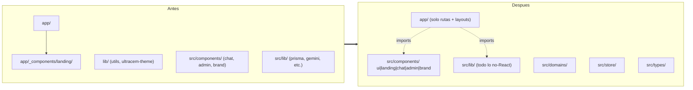

## Resumen ejecutivo

El proyecto tiene hoy **dos identidades visuales conviviendo** (blueprint industrial en código vs. institucional sobrio en foundations.md), **una estructura de carpetas duplicada** (`/lib` y `/src/lib`, `app/_components/` y `src/components/`) y **un AGENTS.md desactualizado** que aún cita la paleta naranja deprecada. Este plan resuelve los tres frentes en paralelo y deja instrucciones blindadas para futuros modelos.

---

## 1. Dirección de diseño: "Institucional Sobrio UltraCem"

Línea única, alineada estrictamente con [`docs/foundations.md`](docs/foundations.md). Punto de inspiración: la propia [`ultracem.co`](https://ultracem.co/) — calmada, editorial, con un acento amarillo decisivo.

### 1.1 Principios irrompibles

- **Una sola fuente:** Montserrat (400/500/600/700) vía `next/font/google`. Se elimina toda referencia a `Bebas Neue` y `font-display` (hoy se referencia sin importarse).
- **Paleta 60/25/10/5:** neutros 60%, azul `#003E78` 25%, amarillo `#FFCA00` 10%, verde `#23A455` 5%. Nada de gradientes morados, nada de naranjas heredados.
- **Sin decoración técnica:** se eliminan `blueprint-grid`, `corner-brackets`, `tech-border`, líneas diagonales y "noise overlay" — son la otra identidad y rompen la coherencia con la web madre.
- **Radios oficiales:** botones `16px`, cards `25px`, inputs `16px`. Token-only.
- **Sentence case en UI**, MAYÚSCULAS reservadas para eyebrows/labels cortos (chip eyebrow de sección).
- **Animación mínima:** fade-in-up y stagger ligero; sin floats infinitos en hero ni glow shadows.

### 1.2 Tokens canónicos (consolidados en `src/lib/design-tokens.ts`)

| Token | Valor | Uso |
|-------|-------|-----|
| `bg-ultracem-blue` | `#003E78` | Banda hero, header, primario |
| `bg-ultracem-yellow` | `#FFCA00` | CTA secundario, eyebrow |
| `text-ultracem-gray-900` | `#393939` | Body |
| `rounded-uc-button` | `16px` | Todo botón |
| `rounded-uc-card` | `25px` | Cards y cards de mockup |
| `shadow-uc-card` | def. foundations §5.5 | Elevación estándar |

Prohibido: valores arbitrarios tipo `text-[13px]`, `bg-white/[0.07]`, `text-[clamp(...)]` salvo justificación en code review.

---

## 2. Mejora de interfaz — componente por componente

Cambios concretos, todos hacia "institucional sobrio".

### 2.1 [`app/layout.tsx`](app/layout.tsx)
- Aplicar `${montserrat.variable} font-sans` también al `<body>` (hoy la variable se define pero `body` usa `font-sans` plano sin `var(--font-montserrat)`).
- Quitar `Bebas Neue` de todo el theme. Mapear `fontFamily.sans` a `["var(--font-montserrat)", "system-ui", "sans-serif"]`.
- Eliminar `font-display` como utility con Bebas Neue.

### 2.2 [`app/_components/landing/hero-section.tsx`](app/_components/landing/hero-section.tsx)
- **Quitar** las 3 circunferencias amarillas (`-right-[150px]`, `-bottom-[100px]`, etc.) y el grid lineal de fondo (es vocabulario "blueprint").
- **Sustituir** por banda azul plana con un único acento: una línea amarilla `h-[3px] w-32` antes del H1 (patrón divider de foundations §6.5).
- Tipografía: `text-display` token, no `clamp` arbitrario.
- CTAs: usar la utility `.btn-secondary` (amarillo) + `.btn-outline` blanco — sin `hover:-translate-y-px` (animación micro innecesaria).

### 2.3 [`app/_components/landing/chat-mockup.tsx`](app/_components/landing/chat-mockup.tsx)
- Quitar `animate-float` (foundations no contempla floats infinitos; viola `prefers-reduced-motion` la mitad del tiempo).
- Burbujas: usar utilities `.bubble-user` y `.bubble-assistant` ya existentes en `globals.css` (hoy se reinventan inline).
- Sombra: `shadow-uc-card` token, no `shadow-[0_24px_64px_rgba(0,0,0,0.35)]`.

### 2.4 [`app/_components/landing/flow-section.tsx`](app/_components/landing/flow-section.tsx)
- Mantener el split de 2 columnas — está bien resuelto.
- Cards de selector: cambiar `bg-white/[0.07]` por `bg-white/5` (en escala) o mejor: invertir la sección a fondo claro con cards `bg-ultracem-surface` y borde `border-ultracem-gray-100`. Coherente con web madre.
- Eyebrow: usar componente `Eyebrow` reutilizable (ver §3).

### 2.5 [`app/_components/landing/tools-section.tsx`](app/_components/landing/tools-section.tsx)
- Ya es la sección más coherente. Solo:
  - Reemplazar `text-[clamp(...)]` por `text-h1`/`text-h2`.
  - Quitar `hover:-translate-y-0.5` (micro-animación ruidosa).

### 2.6 [`src/components/chat/WelcomeScreen.tsx`](src/components/chat/WelcomeScreen.tsx) — refactor mayor
- **Eliminar** `blueprint-grid`, `noise-overlay`, líneas diagonales, `corner-brackets`.
- **Eliminar** `font-display` 6xl-7xl con Bebas Neue.
- **Sustituir** por composición editorial: logo centrado, H1 Montserrat 700 (`text-display`), subhead, CTA amarillo, grid 2×2 de features con `card-uc` sutil.

### 2.7 [`src/components/chat/ChatContainer.tsx`](src/components/chat/ChatContainer.tsx)
- Quitar `blueprint-grid-light` del area scrollable → fondo plano `bg-ultracem-surface-muted`.
- Quitar shadow grande del header `shadow-[0_8px_28px_rgba(0,62,120,0.18)]` → `shadow-uc-card`.

### 2.8 [`src/components/chat/MessageBubble.tsx`](src/components/chat/MessageBubble.tsx)
- Eliminar las "esquinas amarillas" decorativas (`absolute -left-1 -top-1 h-3 w-3 border-l-2 border-t-2 border-ultracem-yellow/40`) — vocabulario blueprint.
- Eliminar el grid blanco superpuesto en burbuja usuario.
- Mantener animación `slide-in-left/right`: está bien dosificada.

### 2.9 [`src/components/chat/CalculationResult.tsx`](src/components/chat/CalculationResult.tsx)
- Cambiar `corner-brackets` por `border border-ultracem-blue/15 rounded-uc-card`.
- Quitar el grid de fondo dentro de la card.
- `font-display` → Montserrat 700 con tamaños del theme.

### 2.10 [`app/_components/landing/landing-nav.tsx`](app/_components/landing/landing-nav.tsx) y [`landing-footer.tsx`](app/_components/landing/landing-footer.tsx)
- Reemplazar `text-[13px]` por `text-body-sm` token.
- Nav: añadir patrón "underline fade on hover" descrito en foundations §7.1.

---

## 3. Sistema de UI reusable (nuevo)

Crear `src/components/ui/` con primitivos que erradican los valores arbitrarios:

- `Container.tsx` — wrap `max-w-uc-container` + padding responsive.
- `Section.tsx` — `<section>` con prop `tone: "light" | "blue" | "yellow"` y eyebrow opcional.
- `Eyebrow.tsx` — el chip/eyebrow reusable (hoy duplicado en hero, flow, tools).
- `Button.tsx` — variants `primary | secondary | outline | ghost` vía `cva` (ya está `class-variance-authority` en deps).
- `Card.tsx` — `card-uc` tipado.

Beneficio: las páginas se vuelven declarativas y un modelo futuro no puede romper el sistema escribiendo `bg-white/[0.07]`.

---

## 4. Refactor de estructura — consolidación en `/src`

### 4.1 Estado actual vs. objetivo



### 4.2 Movimientos concretos

| Origen | Destino |
|--------|---------|
| `lib/utils.ts` | `src/lib/utils.ts` |
| `lib/ultracem-theme.ts` | `src/lib/design-tokens.ts` (rename + cleanup) |
| `app/_components/landing/*` | `src/components/landing/*` |
| `app/_components/` (carpeta) | eliminar |
| `lib/` (carpeta raíz) | eliminar |
| `components/`, `hooks/` (globs Tailwind) | eliminar globs |

### 4.3 [`tsconfig.json`](tsconfig.json) — limpiar paths
- Dejar **solo** `"@/*": ["./src/*"]`.
- Eliminar el alias dual `"@/lib/*": ["./src/lib/*", "./lib/*"]` (causa resolución ambigua).

### 4.4 [`tailwind.config.ts`](tailwind.config.ts) — globs reales
```ts
content: [
  "./app/**/*.{ts,tsx,mdx}",
  "./src/**/*.{ts,tsx,mdx}",
],
```
Importar el theme desde `./src/lib/design-tokens` (no `./lib/ultracem-theme`).

### 4.5 [`app/globals.css`](app/globals.css) — eliminar utilidades muertas
Quitar `blueprint-grid`, `blueprint-grid-light`, `noise-overlay`, `corner-brackets`, `tech-border`, `tech-border-light`, `.font-display`, `animate-float` (no se usará). Mantener: `.btn-primary/secondary/outline`, `.input-uc`, `.bubble-user/assistant`, `.container-uc`, `.card-uc`, `animate-fade-in-up`, `animate-slide-in-*`, `stagger-*`.

### 4.6 Orden seguro de ejecución (sin romper imports)
1. Crear `src/components/landing/` y `src/components/ui/`.
2. Mover archivos (mantener nombres) y actualizar imports relativos a `@/lib/utils`.
3. Mover `lib/utils.ts` y `lib/ultracem-theme.ts` (rename) a `src/lib/`.
4. Actualizar [`tsconfig.json`](tsconfig.json) y [`tailwind.config.ts`](tailwind.config.ts).
5. Refactor visual de cada componente (§2) consumiendo nuevos primitivos UI (§3).
6. Borrar `lib/`, `app/_components/`, utilities muertas en `globals.css`.
7. `bun run lint && bun run build` debe pasar.

---

## 5. Instrucciones blindadas para futuros modelos

Dos artefactos que **garantizan** que cualquier agente futuro respete este sistema:

### 5.1 Reescribir [`docs/AGENTS.md`](docs/AGENTS.md)
Cambios obligatorios:
- Quitar todas las referencias a `ultracem-orange`, `#FF6B35`, `#E55A2A` (foundations.md ya las marca como erróneas).
- Quitar el patrón "atoms/molecules/organisms" — sustituir por `ui/` (primitivos) + `<feature>/` (composición).
- Quitar referencia a `src/app/` (no existe; el App Router vive en `app/` en raíz).
- Añadir sección **"Design System Compliance"** con:
  - Lista negra de utilities y patrones (`blueprint-*`, `corner-brackets`, `font-display` con Bebas Neue, `text-[Npx]` arbitrarios, gradientes morados, naranjas).
  - Lista blanca de tokens (`text-h1`, `text-body`, `rounded-uc-button`, `bg-ultracem-blue`, etc.).
  - Regla: cualquier componente nuevo se construye sobre primitivos de `src/components/ui/`.
  - Regla: paleta solo desde `foundations.md §3`.

### 5.2 Crear `.cursor/rules/frontend.mdc`
Regla autoaplicada por glob a `app/**/*.tsx` y `src/components/**/*.tsx`:

```md
---
description: UltraCem frontend design system enforcement
globs:
  - "app/**/*.tsx"
  - "src/components/**/*.tsx"
alwaysApply: false
---

# UltraCem UI rules

1. Paleta: solo tokens `ultracem-*` declarados en `src/lib/design-tokens.ts`. Prohibido `ultracem-orange`, `#FF6B35`.
2. Tipografía: solo Montserrat. Prohibido `font-display` (Bebas Neue) y cualquier import adicional de fuentes.
3. Tamaños: usar `text-display | text-h1 | text-h2 | text-h3 | text-body | text-body-sm | text-caption | text-button`. Prohibido `text-[Npx]` arbitrario salvo justificación en PR.
4. Radius: `rounded-uc-button | rounded-uc-card | rounded-uc-input | rounded-full`. Nada de `rounded-[20px]`.
5. Composicion: cualquier seccion nueva usa `<Section>` y `<Container>` de `src/components/ui/`. Botones usan `<Button>` (variants).
6. Prohibido: `blueprint-grid`, `blueprint-grid-light`, `corner-brackets`, `tech-border`, `noise-overlay`, `animate-float`.
7. Animacion: solo `animate-fade-in-up`, `animate-slide-in-left|right`, `stagger-1..5`. Respeta `prefers-reduced-motion`.
8. Antes de crear un componente, busca si existe en `src/components/ui/` o en la feature correspondiente.
9. La fuente de verdad visual es `docs/foundations.md`. Ante conflicto con cualquier otro doc, gana foundations.
```

### 5.3 Actualizar [`docs/frontend.md`](docs/frontend.md)
Reescribirlo para que en lugar de la skill genérica "frontend-design" describa **el sistema UltraCem específico**: la dirección "Institucional Sobrio", links a foundations.md y a la regla Cursor, y ejemplos de antes/después de los componentes refactorizados.

---

## 6. Criterios de aceptación

- [ ] `bun run build` pasa sin warnings de imports rotos.
- [ ] `rg "ultracem-orange|#FF6B35|Bebas Neue|blueprint-grid|corner-brackets|font-display"` devuelve 0 resultados en `app/` y `src/`.
- [ ] No existen las carpetas `lib/`, `app/_components/`, `components/`, `hooks/` en raíz.
- [ ] `tsconfig.json` tiene un solo alias `@/*`.
- [ ] Existe `src/components/ui/` con `Container`, `Section`, `Eyebrow`, `Button`, `Card`.
- [ ] Existe `.cursor/rules/frontend.mdc` con las reglas de §5.2.
- [ ] `docs/AGENTS.md` ya no menciona `ultracem-orange` ni `src/app/` ni atomic design.
- [ ] La home y `/chat` se ven coherentes con [`ultracem.co`](https://ultracem.co/) (verificación visual manual).