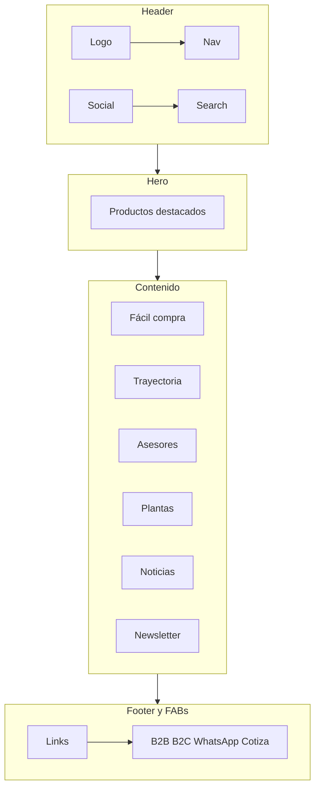

# UltraCem — Design Foundations

**Versión:** 1.0  
**Fecha de auditoría:** 23 de mayo de 2026  
**Fuente principal:** [https://ultracem.co/](https://ultracem.co/)  
**Propósito:** Guía de marca, UI y UX para el chatbot UltraCem y cualquier interfaz derivada del ecosistema digital.

---

## 1. Resumen de marca

### 1.1 Posicionamiento

UltraCem es una **compañía colombiana** fabricante y comercializadora de:

- Cemento hidráulico (gris, blanco, uso general y estructural)
- Concretos y mezclas listas
- Cal hidratada
- Pegantes cerámicos y cementosos
- Soluciones para revoque, pañete, estuco y drywall

El sitio se presenta como **“Fábrica de Cemento | Cemento Gris | Pegante Cerámico | Concretos”**, enfatizando calidad, rendimiento y facilidad de uso en obra.

### 1.2 Valores percibidos (desde el sitio)

| Valor | Evidencia en copy |
|-------|-------------------|
| Innovación | “Compañía innovadora, vanguardista” (sección Trayectoria) |
| Compromiso | Satisfacción de clientes y aliados comerciales |
| Calidad técnica | Fichas de producto, referencias PSI, adherencia, bajo deslizamiento |
| Cercanía | “¡Bienvenido a casa!”, asesores por región, WhatsApp |
| Confianza | Plantas estratégicas, directorio comercial, blog institucional |

### 1.3 Audiencias

| Segmento | Necesidad | Touchpoint en sitio |
|----------|-----------|---------------------|
| Maestro de obra / contratista | Calcular materiales, elegir producto correcto | Productos, blog, chatbot (futuro) |
| Distribuidor / proveedor | Relación comercial | Sección Proveedores |
| Cliente hogar | Compra directa | [Tienda B2C](https://b2c.ultracem.co/) |
| Cliente institucional / B2B | Cotización y volumen | [B2B](https://b2b.ultracem.co/landing), “Cotiza aquí” |
| Inversionista | Gobierno corporativo, finanzas | Menú Inversionistas |
| Público general | Noticias, sostenibilidad | Blog, Nosotros |

### 1.4 Tono de voz

- **Idioma:** español (Colombia). Evitar anglicismos innecesarios; “newsletter” se usa entre comillas en el sitio.
- **Registro:** profesional pero cercano; tuteo implícito al usuario de obra (“tu proyecto”, “tus obras”).
- **Titulares de sección:** frecuentemente en **MAYÚSCULAS** con punto final opcional (`NUESTROS PRODUCTOS`, `MEZCLA LISTA.`, `TRAYECTORIA ULTRACEM`).
- **Promesas concretas:** beneficios medibles (“Pañeta y estuca el mismo día”, “promesa 2 en 1”).
- **CTAs habituales:** “Conoce más”, “VER TODOS…”, “Cotiza aquí”, “Enviar” (newsletter).

**Ejemplos de microcopy alineado:**

- ✅ “Solo necesitas agregar agua y empezar su uso.”
- ✅ “Productos de alta calidad para hacer realidad tus obras.”
- ❌ “Our premium cement solution delivers unmatched synergy.” (fuera de tono)

### 1.5 Líneas de producto (nomenclatura)

Usar los nombres oficiales del sitio:

- Mezcla Lista
- Cal Hidratada
- Pegante (cerámico / cementoso; variantes gris y blanco)
- Cemento (UG, estructural, blanco, etc.)
- Concretos
- Masillas y soluciones especializadas (blog: Drywall, etc.)

---

## 2. Logo y uso

### 2.1 Asset principal

| Propiedad | Valor |
|-----------|-------|
| URL | `https://ultracem.co/wp-content/uploads/2017/06/logo.png` |
| Página de referencia | [ultracem.co/logo/](https://ultracem.co/logo/) |
| Formato | PNG (fondo transparente recomendado en implementaciones) |

### 2.2 Descripción visual

El logotipo combina **tipografía corporativa** con la identidad “UltraCem” en colores de marca (azul `#003E78` y acentos amarillos en aplicaciones digitales). En header aparece sobre fondo claro o dentro de barras azules según breakpoint.

### 2.3 Reglas de uso (para el chatbot)

| Regla | Detalle |
|-------|---------|
| Zona de respiro | Mínimo equivalente a la altura de la “U” del wordmark alrededor del logo |
| Fondos permitidos | Blanco `#FFFFFF`, gris muy claro `#F9FAFB`, azul corporativo `#003E78` (logo en blanco si aplica versión invertida) |
| Fondos prohibidos | Patrones recargados, fotos de obra sin overlay, colores que reduzcan contraste |
| Tamaño mínimo digital | 120px ancho en mobile; 160px+ en desktop header |
| No hacer | Estirar, rotar, cambiar colores del logo, añadir sombras exageradas |

### 2.4 Favicon y meta

El sitio usa título SEO del tipo: `CEMENTO ULTRACEM | Venta de Cemento y Concreto`. Para el chatbot:

```text
Título sugerido: UltraCem | Calculadora de materiales
Descripción: Asistente para calcular cemento, arena y materiales de construcción.
```

---

## 3. Paleta de color

### 3.1 Tokens oficiales (extraídos de Elementor Kit, mayo 2026)

Estos son los colores **reales del sitio** (`--e-global-color-*` en CSS). La web es la fuente de verdad.

| Token semántico | Hex | RGB | Uso |
|-----------------|-----|-----|-----|
| `brand-primary` | `#003E78` | 0, 62, 120 | Header, fondos de banda, botones primarios, iconos, nav |
| `brand-primary-hover` | `#022443` | 2, 36, 67 | Hover en bloques del header |
| `brand-accent-yellow` | `#FFCA00` | 255, 202, 0 | Botones secundarios, acentos carrusel |
| `brand-accent-yellow-alt` | `#FFDA05` | 255, 218, 5 | Flechas carrusel, bordes búsqueda |
| `brand-accent-yellow-hover` | `#E8C204` | 232, 194, 4 | Hover iconos redes sociales |
| `brand-accent-green` | `#23A455` | 35, 164, 85 | Acento sostenibilidad / éxito |
| `brand-accent-green-alt` | `#61CE70` | 97, 206, 112 | Acento Elementor (links activos legacy) |
| `text-primary` | `#393939` | 57, 57, 57 | Títulos y texto fuerte |
| `text-secondary` | `#7A7A7A` | 122, 122, 122 | Cuerpo, metadatos |
| `text-muted` | `#54595F` | 84, 89, 95 | Texto terciario (kit Elementor) |
| `surface-white` | `#FFFFFF` | 255, 255, 255 | Cards, fondos principales |
| `surface-off-white` | `#FCFCFC` | 252, 252, 252 | Botones submit sobre azul |
| `surface-gray-50` | `#F9FAFB` | 249, 250, 251 | Fondos alternos |
| `surface-gray-100` | `#F2F4F7` | 242, 244, 247 | Separadores suaves |
| `border-default` | `#D0D5DD` | 208, 213, 221 | Inputs (patrón formularios modernos en sitio) |
| `brand-gold` | `#CEA261` | 206, 162, 97 | Acento puntual (kit) |
| `brand-purple` | `#302489` | 48, 36, 137 | Acento secundario puntual (kit) |
| `semantic-error` | `#F04438` | 240, 68, 56 | Alertas (referencia UI moderna en CSS) |
| `semantic-success` | `#12B76A` | 18, 183, 106 | Confirmaciones |

### 3.2 Proporción de uso recomendada (UI chatbot)

```text
60% — Neutros (blancos, grises claros) + texto gris
25% — Azul corporativo (#003E78)
10% — Amarillo acento (#FFCA00 / #FFDA05)
5%  — Verde (#23A455) solo para éxito/ahorro ambiental
```

### 3.3 Contraste y accesibilidad

| Combinación | Ratio aprox. | Uso |
|-------------|--------------|-----|
| `#003E78` sobre `#FFFFFF` | ~9.5:1 | ✅ Texto y botones primarios |
| `#FFFFFF` sobre `#003E78` | ~9.5:1 | ✅ Nav, bandas, footer |
| `#393939` sobre `#FFFFFF` | ~10:1 | ✅ Cuerpo |
| `#FFCA00` sobre `#FFFFFF` | ~1.4:1 | ⚠️ Solo como acento, no texto pequeño |
| `#FFCA00` sobre `#003E78` | ~6:1 | ✅ Texto oscuro o iconos sobre amarillo con cuidado |

**Regla:** texto de cuerpo siempre en gris oscuro o blanco; el amarillo es para fondos de botón, badges y highlights — no para párrafos largos.

### 3.4 Variables CSS sugeridas (chatbot)

```css
:root {
  --uc-brand-primary: #003e78;
  --uc-brand-primary-hover: #022443;
  --uc-brand-yellow: #ffca00;
  --uc-brand-yellow-bright: #ffda05;
  --uc-brand-green: #23a455;
  --uc-text-primary: #393939;
  --uc-text-secondary: #7a7a7a;
  --uc-surface: #ffffff;
  --uc-surface-muted: #f9fafb;
  --uc-radius-button: 16px;
  --uc-radius-card: 25px;
  --uc-container-max: 1140px;
}
```

### 3.5 Mapeo Tailwind recomendado

Reemplazar o alinear [`tailwind.config.ts`](tailwind.config.ts) con:

```typescript
colors: {
  ultracem: {
    blue: {
      DEFAULT: "#003E78",
      dark: "#022443",
      light: "#1A5A9E", // derivado para hover suave
    },
    yellow: {
      DEFAULT: "#FFCA00",
      bright: "#FFDA05",
      hover: "#E8C204",
    },
    green: {
      DEFAULT: "#23A455",
      light: "#61CE70",
    },
    gray: {
      900: "#393939",
      600: "#7A7A7A",
      100: "#F2F4F7",
      50: "#F9FAFB",
    },
  },
},
```

---

## 4. Tipografía

### 4.1 Familias

| Rol | Familia | Pesos | Fallback |
|-----|---------|-------|----------|
| Display / H1–H2 | **Montserrat** | 600 (semibold) | `system-ui, sans-serif` |
| Subtítulos | **Montserrat** | 500 (medium) | idem |
| Cuerpo | **Montserrat** | 400 (regular) | idem |
| Legal / caption | **Montserrat** | 400 | idem |

> **Nota:** El CSS del sitio referencia también “Gotham” (`gothan`) como fuente corporativa con licencia. En el chatbot usar **Montserrat vía `next/font/google`** por disponibilidad y paridad visual cercana.

### 4.2 Escala tipográfica

| Elemento | Tamaño | Peso | Line-height | Letter-spacing |
|----------|--------|------|-------------|----------------|
| Display (hero) | 48px / 3rem | 600 | 1.1 | -0.02em |
| H1 sección | 30px / 1.875rem | 600 | 1.2 | 0 |
| H2 | 24px / 1.5rem | 600 | 1.25 | 0 |
| H3 | 20px / 1.25rem | 500 | 1.3 | 0 |
| Body | 16px / 1rem | 400 | 1.5 | 0 |
| Body small | 14px / 0.875rem | 400 | 1.5 | 0 |
| Caption / legal | 12px / 0.75rem | 400 | 1.4 | 0 |
| Botón | 14–16px | 500–600 | 1 | 0.02em |

### 4.3 Estilo de titulares

- Secciones institucionales/producto: **MAYÚSCULAS** opcional en marketing; en UI del chatbot preferir **sentence case** para legibilidad (`Tus materiales calculados` vs `TUS MATERIALES CALCULADOS`).
- Evitar más de dos pesos en una misma pantalla.

### 4.4 Implementación Next.js

```typescript
import { Montserrat } from "next/font/google";

const montserrat = Montserrat({
  subsets: ["latin"],
  weight: ["400", "500", "600"],
  variable: "--font-montserrat",
});
```

---

## 5. Espaciado y layout

### 5.1 Escala de espaciado

Basada en ritmo del sitio (múltiplos de 4px) y `--widgets-spacing: 20px`:

| Token | Valor | Uso |
|-------|-------|-----|
| `space-1` | 4px | Ajustes finos |
| `space-2` | 8px | Gap entre icono y texto |
| `space-3` | 12px | Padding interno chips |
| `space-4` | 16px | Padding botones, márgenes mobile |
| `space-5` | 20px | Separación entre widgets (estándar Elementor) |
| `space-6` | 24px | Padding cards |
| `space-8` | 32px | Separación entre bloques |
| `space-10` | 40px | Secciones compactas |
| `space-12` | 48px | Padding vertical secciones |
| `space-16` | 64px | Hero / separadores grandes |

### 5.2 Contenedor y grid

| Propiedad | Valor |
|-----------|-------|
| Max-width contenido | `1140px` |
| Padding horizontal mobile | `16px` (`p-4`) |
| Padding horizontal desktop | `24px` (`p-6`) |
| Columnas producto (homepage) | 1 col mobile → 2–3 tablet → 3–4 desktop |
| Gap grid cards | `20px`–`24px` |

### 5.3 Breakpoints (Tailwind estándar, alineado al sitio)

| Breakpoint | Min-width | Comportamiento observado |
|------------|-----------|---------------------------|
| `sm` | 640px | Nav colapsado → drawer |
| `md` | 768px | Carrusel 2 slides; imágenes ~171px |
| `lg` | 1024px | Nav horizontal completo |
| `xl` | 1280px | Contenedor centrado max 1140px |

### 5.4 Border radius

| Elemento | Radius |
|----------|--------|
| Botón primario/secundario | `16px` |
| Card / imagen producto | `25px` |
| Input newsletter | `16px` (coherente con botones) |
| Avatar / badge circular | `9999px` (full) |
| Burbuja de chat | `16px` con esquina cortada en mensaje (`rounded-2xl` + `rounded-br-sm` usuario) |

### 5.5 Sombras

El sitio usa transiciones suaves más que sombras profundas:

```css
/* Elevación card chatbot */
box-shadow: 0 1px 3px rgba(0, 62, 120, 0.08), 0 4px 12px rgba(0, 0, 0, 0.06);

/* Modal / drawer */
box-shadow: 0 8px 24px rgba(0, 36, 67, 0.15);
```

---

## 6. Componentes UI

### 6.1 Botones

#### Primario (azul)

```text
Fondo: #003E78
Texto: #FFFFFF
Hover: #022443
Radius: 16px
Padding: 12px 24px
Font: Montserrat 600, 14–16px
```

Clases Tailwind sugeridas: `bg-ultracem-blue text-white hover:bg-ultracem-blue-dark rounded-2xl px-6 py-3 font-semibold`

#### Secundario (amarillo)

```text
Fondo: #FFCA00
Texto: #003E78 o #393939
Hover: #E8C204
```

#### Outline

```text
Borde: 2px solid #003E78
Texto: #003E78
Fondo: transparente
Hover: fondo #003E78, texto blanco
```

#### Estados

| Estado | Tratamiento |
|--------|-------------|
| Disabled | Opacidad 50%, sin hover |
| Loading | Spinner blanco sobre primario; texto “Calculando…” |
| Focus | `ring-2 ring-ultracem-yellow ring-offset-2` |

### 6.2 Campos de formulario (newsletter / chat input)

| Propiedad | Valor |
|-----------|-------|
| Altura mínima | 48px (touch-friendly) |
| Borde | `1px solid #D0D5DD` |
| Radius | 16px |
| Focus | borde `#003E78`, ring amarillo suave |
| Placeholder | `#7A7A7A` |
| Fondo sobre sección azul | `#FCFCFC` |

### 6.3 Cards de producto / resultado

Estructura observada en homepage:

```text
┌─────────────────────────┐
│  [Imagen 25px radius]   │
│  TÍTULO PRODUCTO        │
│  Descripción breve...     │
│  [ Conoce más → ]       │
└─────────────────────────┘
```

Para el chatbot (resultado de cálculo):

```text
┌─────────────────────────┐
│  Logo producto          │
│  Nombre + PSI / uso       │
│  Tabla materiales         │
│  Ahorro $ y CO₂ (verde)   │
│  [ Cotizar ] [ Nuevo ]    │
└─────────────────────────┘
```

### 6.4 Burbujas de chat

| Rol | Alineación | Fondo | Texto |
|-----|------------|-------|-------|
| Usuario | Derecha | `#003E78` | `#FFFFFF` |
| Asistente | Izquierda | `#F2F4F7` o `#FFFFFF` con borde | `#393939` |
| Sistema / error | Centro | `#FEE4E2` | `#912F3D` |

### 6.5 Dividers y acentos

- Línea divisoria: `1px solid #FFCA00` al 50% ancho (patrón sección en homepage).
- Barra de progreso / steps: amarillo sobre fondo gris claro.

### 6.6 Iconografía

- Redes: Font Awesome 5 (sitio); en chatbot usar **lucide-react** o **heroicons** con trazo 1.5–2px.
- Tamaño nav/social: 16–20px; CTAs flotantes: 24px.
- Color iconos en header: `#003E78`; hover social: fondo `#E8C204`.

### 6.7 Acciones flotantes (FAB) — patrón del sitio

Cuatro acciones persistentes en esquina inferior (replicar como barra compacta en móvil del chatbot):

| Acción | Destino | Icono sugerido |
|--------|---------|----------------|
| Ultracem en línea | b2b.ultracem.co | Edificio / briefcase |
| Tienda Hogar | b2c.ultracem.co | Carrito |
| WhatsApp Vanesa | api.whatsapp.com | WhatsApp |
| Cotiza aquí | /cotizar-ultracem/ | Calculadora / documento |

---

## 7. Patrones de página (sitio web)

### 7.1 Header

- Logo izquierda
- “Síguenos” + iconos redes
- Buscador global
- Menú horizontal: Países, Inversionistas, Nosotros, Productos (+ submenús)
- Mobile: hamburger + drawer
- Nav: underline fade en hover (`e--pointer-underline e--animation-fade`)

### 7.2 Hero / carrusel de productos

- Título: `NUESTROS PRODUCTOS`
- Slides: Mezcla Lista, Cal Hidratada, Pegante
- Cada slide: imagen, H2 producto, párrafo, CTA “Conoce más de…”

### 7.3 Sección compra fácil

- Mensaje: “Ahora comprar productos Ultracem es mucho más fácil”
- Enlace a tiendas digitales

### 7.4 Trayectoria

- Fondo con imagen / parallax (`background-attachment: fixed` en desktop)
- Texto corporativo sobre innovación

### 7.5 Asesores comerciales

- Cards por persona: nombre, ciudad/departamento
- CTA: `VER TODOS LOS ASESORES`

### 7.6 Plantas

- Copy sobre ubicación estratégica
- Integración Google Maps y reseñas

### 7.7 Blog

- Grid de posts: imagen, título, fecha, extracto
- CTA: `VER TODOS LOS BLOGS`

### 7.8 Newsletter

- Título: “¡Bienvenido a casa!”
- Subcopy sobre novedades y ofertas
- Campo email + botón “Enviar”
- Fondo: banda `#003E78`, inputs claros

### 7.9 Footer

- Enlaces corporativos, legal
- Copyright: “© Copyright | All Rights Reserved”
- Tipografía ~12px en blanco sobre azul

### 7.10 Diagrama de flujo (homepage)



---

## 8. UX y microcopy (chatbot)

### 8.1 Principios UX

1. **Mobile-first:** una mano, pulgar alcanza input y enviar.
2. **< 90 segundos** para flujo completo (meta del producto).
3. **Lenguaje natural primero:** el usuario describe la obra; el sistema pide solo lo faltante.
4. **Resultados escaneables:** tabla de materiales + producto recomendado + ahorro.
5. **Salida clara:** siempre ofrecer “Nuevo cálculo” y “Cotizar”.

### 8.2 Flujo conversacional sugerido

```text
1. Saludo + propuesta de valor
2. Pregunta abierta (“¿Qué vas a construir?”)
3. Clarificación (dimensiones, tipo estructura)
4. Cálculo + recomendación UltraCem
5. Ahorro económico y ambiental
6. CTAs: cotización / WhatsApp / ficha técnica
```

### 8.3 Mensajes tipo

| Contexto | Ejemplo |
|----------|---------|
| Saludo | “Hola, soy tu asistente UltraCem. Cuéntame qué obra tienes en mente.” |
| Clarificación | “¿Cuáles son las medidas de la placa? (largo × ancho en metros)” |
| Resultado | “Para tu muro de 12 m² necesitas aproximadamente…” |
| Error | “No pude entender las medidas. ¿Puedes escribirlas así: 3m × 4m?” |
| Éxito ambiental | “Con UltraCem ahorras ~X kg de CO₂ frente al cemento genérico.” |

### 8.4 CTAs del chatbot

| CTA | Prioridad | Estilo |
|-----|-----------|--------|
| Calcular / Enviar | Primaria | Azul |
| Ver ficha técnica | Secundaria | Outline |
| Cotizar | Secundaria | Amarillo |
| Nuevo cálculo | Terciaria | Text link gris |

---

## 9. Accesibilidad

| Criterio | Requisito |
|----------|-----------|
| Idioma | `lang="es"` en `<html>` |
| Contraste texto | WCAG AA mínimo (4.5:1 cuerpo, 3:1 UI grande) |
| Focus visible | Ring amarillo `#FFDA05` sobre controles |
| Touch targets | Mínimo 44×44px |
| Motion | Respetar `prefers-reduced-motion` |
| Imágenes | `alt` descriptivo en productos |
| Formularios | Labels visibles o `aria-label` en input chat |

---

## 10. Implementación en el chatbot

### 10.1 Archivos del repo a alinear

| Archivo | Estado actual | Acción recomendada |
|---------|---------------|-------------------|
| [`tailwind.config.ts`](tailwind.config.ts) | Azul `#004F9F`, amarillo `#FDB813` | Actualizar a `#003E78` y `#FFCA00` |
| [`app/globals.css`](app/globals.css) | Variables genéricas slate | Sustituir por tokens `--uc-*` |
| [`app/layout.tsx`](app/layout.tsx) | Fuente Inter | Cambiar a Montserrat |
| [`app/page.tsx`](app/page.tsx) | Placeholder slate/blue | Aplicar foundations en UI real |
| [`AGENTS.md`](AGENTS.md) | `ultracem-orange` `#FF6B35` | Corregir a paleta azul/amarillo |
| [`docs/specs.md`](docs/specs.md) | Botones `ultracem-orange-600` | Actualizar referencias UI |

### 10.2 Tabla de discrepancias (documentado)

> **IMPORTANTE:** Existen tres paletas distintas en el repositorio. Para consistencia con la marca web, prevalece esta guía (`foundations.md`).

| Fuente | Color primario | Acento | Notas |
|--------|----------------|--------|-------|
| **ultracem.co (oficial)** | `#003E78` azul | `#FFCA00` amarillo | ✅ Fuente de verdad |
| **`tailwind.config.ts` actual** | `#004F9F` azul | `#FDB813` amarillo | ⚠️ Cercano pero no exacto |
| **`AGENTS.md` / `specs.md`** | `#FF6B35` naranja | `#E55A2A` | ❌ No coincide con la web |

**Recomendación:** eliminar referencias a `ultracem-orange` en código y documentación interna; usar `ultracem-blue` + `ultracem-yellow`.

### 10.3 Mapeo componente → tokens

| Componente chatbot | Token principal |
|--------------------|-----------------|
| Header app | `ultracem-blue` fondo, logo blanco/color |
| Botón enviar mensaje | `ultracem-blue` |
| Botón cotizar | `ultracem-yellow` |
| Burbuja usuario | `ultracem-blue` |
| Burbuja asistente | `ultracem-gray-100` |
| Badge ahorro CO₂ | `ultracem-green` |
| Links | `ultracem-blue` underline hover |

### 10.4 Checklist pre-merge UI

- [ ] Colores coinciden con sección 3 (hex exactos)
- [ ] Montserrat cargada en layout
- [ ] Botones radius 16px
- [ ] Cards radius 25px
- [ ] Contraste AA verificado
- [ ] Copy en español colombiano
- [ ] Sin referencias a naranja `FF6B35` salvo decisión explícita de rebranding

---

## 11. Referencias y ecosistema digital

### 11.1 URLs principales

| Recurso | URL |
|---------|-----|
| Sitio institucional | https://ultracem.co/ |
| Productos | https://ultracem.co/productos/ |
| Blog / noticias | https://ultracem.co/category/noticias/ |
| Directorio asesores | https://ultracem.co/directorio-comercial-asesores/ |
| Cotización | https://ultracem.co/cotizar-ultracem/ |
| B2B | https://b2b.ultracem.co/landing |
| Tienda hogar | https://b2c.ultracem.co/ |
| WhatsApp comercial | https://api.whatsapp.com/send?phone=573164034858 |
| Logo PNG | https://ultracem.co/wp-content/uploads/2017/06/logo.png |

### 11.2 Redes sociales (patrón de enlaces)

- Facebook, Instagram, LinkedIn, TikTok, X (Twitter), YouTube — rutas regionalizadas bajo `ultracem.co/`

### 11.3 Stack técnico del sitio (referencia)

- CMS: WordPress
- Page builder: Elementor
- Tema base: Astra
- Cache CSS: LiteSpeed
- Contenedor Elementor: max-width 1140px

### 11.4 Historial de cambios

| Versión | Fecha | Cambios |
|---------|-------|---------|
| 1.0 | 2026-05-23 | Auditoría inicial ultracem.co + mapeo chatbot |

---

*Documento generado para el proyecto UltraCem Chatbot. Ante conflicto entre este archivo y otros docs del repo, priorizar los tokens de la sección 3 salvo decisión formal de rebranding.*
