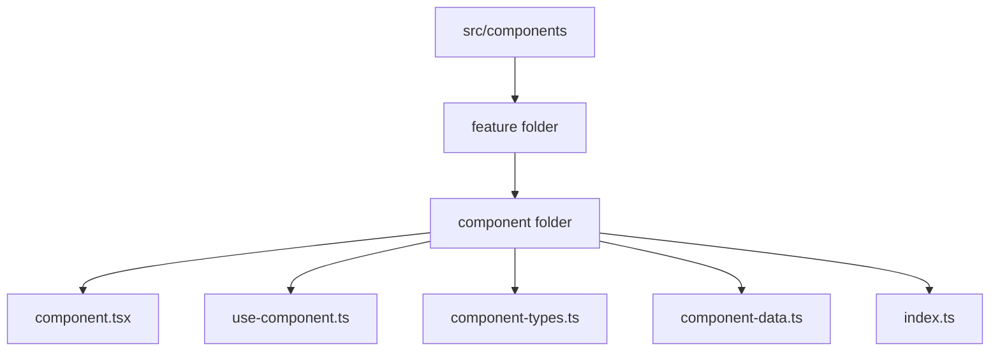

# UltraCem Frontend Design System

This project uses a single frontend direction: **UltraCem Institucional Sobrio**.

The interface should feel close to the institutional UltraCem website: professional, clear, mobile-first, calm, and practical for construction users. Avoid novelty-driven visual language. The yellow accent should guide attention, not dominate the screen.

## Source of Truth

- Brand foundations: `docs/foundations.md`
- Architecture rules: `.cursor/rules/architecture.mdc`
- Design tokens: `src/lib/design-tokens.ts`
- Global utilities: `app/globals.css`
- UI primitives: `src/components/ui/`
- UI enforcement: `.cursor/rules/frontend.mdc`

If this document conflicts with `docs/foundations.md`, follow `docs/foundations.md`.

## Architecture

Every component lives in a kebab-case folder and exposes a public `index.ts` barrel.



Minimum component:

```text
button/
  button.tsx
  index.ts
```

Component with logic:

```text
chat-container/
  chat-container.tsx
  use-chat-container.ts
  chat-container-types.ts
  chat-container-data.ts
  index.ts
```

Create files on demand:

- `use-<component>.ts` when there is state, refs, effects, or extracted handlers.
- `<component>-types.ts` when there are exported or non-trivial interfaces.
- `<component>-data.ts` when static arrays or dictionaries are edited independently.
- `<component>-store.ts` only for shared component-owned Zustand state.

Import from public barrels:

```tsx
import { Button, Card } from "@/components/ui";
import { ChatContainer } from "@/components/chat/chat-container";
```

Do not import another component package's internals.

## Visual Principles

1. Use Montserrat only.
2. Follow the official palette: blue `#003E78`, yellow `#FFCA00`, green `#23A455`, grays from foundations.
3. Prefer white and light gray surfaces. Use blue for header, hero, primary actions, and strong brand moments.
4. Keep spacing generous and predictable.
5. Use cards with `rounded-uc-card` and subtle `shadow-uc-card`.
6. Use yellow for CTAs, dividers, eyebrows, and highlights only.
7. Keep motion subtle and purposeful.

## Component Rules

Use primitives from `src/components/ui/`:

- `Container`: page width and responsive padding.
- `Section`: standard section spacing and tone.
- `Eyebrow`: section labels.
- `Button`: all interactive buttons and CTA links.
- `Card`: content cards and result cards.

Do not hand-roll a new card, button, or section wrapper unless the primitive cannot express the requirement.

## Token Usage

Use tokenized classes:

```tsx
<Section tone="light">
  <Eyebrow>Ejemplo real</Eyebrow>
  <h2 className="text-h1 md:text-display">Asi le puedes hablar a Vanesa</h2>
  <p className="text-body text-ultracem-gray-600">...</p>
  <Button variant="secondary">Hablar con Vanesa</Button>
</Section>
```

Avoid arbitrary values when a token exists:

```tsx
// Avoid
<h2 className="text-[31px]">Titulo</h2>
<div className="rounded-[20px]" />

// Use
<h2 className="text-h1">Titulo</h2>
<div className="rounded-uc-card" />
```

## Prohibited Patterns

Do not add:

- Orange brand colors.
- Extra display fonts.
- `font-display`.
- Blueprint grids.
- Corner brackets.
- Noise overlays.
- Diagonal decorative lines.
- Infinite floating hero cards.
- Purple gradient SaaS patterns.

These patterns conflict with the chosen institutional direction.

## Page Guidance

### Landing

The landing page should explain the value quickly:

1. Hero: blue band, logo/nav, clear H1, yellow CTA, chat mockup.
2. Flow examples: user phrases and result cards.
3. Tools: simple card grid.
4. CTA: yellow band that opens `/chat`.

### Chat

The chat should be mobile-first:

1. Header with UltraCem logo, assistant context, and back link.
2. Welcome screen with centered brand, concise explanation, and 2x2 benefits grid.
3. Message area on light neutral background.
4. Result card with materials, product recommendation, savings, and clear CTAs.

### Admin

Admin UI should share the same tokens and avoid a separate visual identity. Use standard cards, tables, forms, and blue/yellow accents only when they communicate priority.

## Review Checklist

- UI follows `docs/foundations.md`.
- No prohibited pattern appears in `app/` or `src/`.
- Components live in their own kebab-case folders.
- New components use `src/components/ui/` primitives.
- Typography uses `text-*` tokens.
- Radius and shadows use UltraCem tokens.
- Mobile layout works first, then tablet/desktop.
- Focus states are visible.
# UltraCem Frontend Design System

This project uses a single frontend direction: **UltraCem Institucional Sobrio**.

The interface should feel close to the institutional UltraCem website: professional, clear, mobile-first, calm, and practical for construction users. Avoid novelty-driven visual language. The yellow accent should guide attention, not dominate the screen.

## Source of Truth

- Brand foundations: `docs/foundations.md`
- Design tokens: `src/lib/design-tokens.ts`
- Global utilities: `app/globals.css`
- UI primitives: `src/components/ui/`
- Agent enforcement: `.cursor/rules/frontend.mdc`

If this document conflicts with `docs/foundations.md`, follow `docs/foundations.md`.

## Visual Principles

1. Use Montserrat only.
2. Follow the official palette: blue `#003E78`, yellow `#FFCA00`, green `#23A455`, grays from foundations.
3. Prefer white and light gray surfaces. Use blue for header, hero, primary actions, and strong brand moments.
4. Keep spacing generous and predictable.
5. Use cards with `rounded-uc-card` and subtle `shadow-uc-card`.
6. Use yellow for CTAs, dividers, eyebrows, and highlights only.
7. Keep motion subtle and purposeful.

## Component Rules

Use primitives from `src/components/ui/`:

- `Container`: page width and responsive padding.
- `Section`: standard section spacing and tone.
- `Eyebrow`: section labels.
- `Button`: all interactive buttons and CTA links.
- `Card`: content cards and result cards.

Do not hand-roll a new card, button, or section wrapper unless the primitive cannot express the requirement.

## Token Usage

Use tokenized classes:

```tsx
<Section tone="light">
  <Eyebrow>Ejemplo real</Eyebrow>
  <h2 className="text-h1 md:text-display">Asi le puedes hablar a Vanesa</h2>
  <p className="text-body text-ultracem-gray-600">...</p>
  <Button variant="secondary">Hablar con Vanesa</Button>
</Section>
```

Avoid arbitrary values when a token exists:

```tsx
// Avoid
<h2 className="text-[31px]">Titulo</h2>
<div className="rounded-[20px]" />

// Use
<h2 className="text-h1">Titulo</h2>
<div className="rounded-uc-card" />
```

## Prohibited Patterns

Do not add:

- Orange brand colors.
- Extra display fonts.
- `font-display`.
- Blueprint grids.
- Corner brackets.
- Noise overlays.
- Diagonal decorative lines.
- Infinite floating hero cards.
- Purple gradient SaaS patterns.

These patterns conflict with the chosen institutional direction.

## Page Guidance

### Landing

The landing page should explain the value quickly:

1. Hero: blue band, logo/nav, clear H1, yellow CTA, chat mockup.
2. Flow examples: user phrases and result cards.
3. Tools: simple card grid.
4. CTA: yellow band that opens `/chat`.

### Chat

The chat should be mobile-first:

1. Header with UltraCem logo, assistant context, and back link.
2. Welcome screen with centered brand, concise explanation, and 2x2 benefits grid.
3. Message area on light neutral background.
4. Result card with materials, product recommendation, savings, and clear CTAs.

### Admin

Admin UI should share the same tokens and avoid a separate visual identity. Use standard cards, tables, forms, and blue/yellow accents only when they communicate priority.

## Review Checklist

- UI follows `docs/foundations.md`.
- No prohibited pattern appears in `app/` or `src/`.
- New components use `src/components/ui/` primitives.
- Typography uses `text-*` tokens.
- Radius and shadows use UltraCem tokens.
- Mobile layout works first, then tablet/desktop.
- Focus states are visible.
---
name: frontend-design
description: Create distinctive, production-grade frontend interfaces with high design quality. Use this skill when the user asks to build web components, pages, artifacts, posters, or applications (examples include websites, landing pages, dashboards, React components, HTML/CSS layouts, or when styling/beautifying any web UI). Trigger this skill even for vague requests like "make it look nice", "build me a UI", "design a page", "create a component", or "I need a frontend for X". Generates creative, polished code and UI design that avoids generic AI aesthetics. Always use this skill before writing any frontend code — it provides critical design guidelines that dramatically improve output quality.
---
 
# Frontend Design Skill
 
This skill guides creation of distinctive, production-grade frontend interfaces that avoid generic "AI slop" aesthetics. Implement real working code with exceptional attention to aesthetic details and creative choices.
 
## Workflow
 
### 1. Design Thinking (Before Writing Any Code)
 
Understand the context and commit to a *BOLD aesthetic direction*:
 
- *Purpose*: What problem does this interface solve? Who uses it?
- *Tone*: Pick an extreme and commit to it. Options include:
  - Brutally minimal
  - Maximalist chaos
  - Retro-futuristic
  - Organic / natural
  - Luxury / refined
  - Playful / toy-like
  - Editorial / magazine
  - Brutalist / raw
  - Art deco / geometric
  - Soft / pastel
  - Industrial / utilitarian
  - ...or invent your own flavor
- *Constraints*: Technical requirements (framework, performance, accessibility)
- *Differentiation*: What makes this UNFORGETTABLE? What's the one thing someone will remember?
> *CRITICAL*: Choose a clear conceptual direction and execute it with precision. Bold maximalism and refined minimalism both work — the key is intentionality, not intensity.
 
---
 
### 2. Implementation
 
Build working code (HTML/CSS/JS, React, Vue, etc.) that is:
- Production-grade and functional
- Visually striking and memorable
- Cohesive with a clear aesthetic point-of-view
- Meticulously refined in every detail
---
 
## Aesthetic Guidelines
 
### Typography
- Choose fonts that are *beautiful, unique, and interesting*
- Avoid generic fonts: Arial, Inter, Roboto, system fonts
- Opt for distinctive, characterful choices that elevate the interface
- Pair a distinctive *display font* with a refined *body font*
### Color & Theme
- Commit to a cohesive aesthetic using CSS variables for consistency
- Dominant colors with sharp accents outperform timid, evenly-distributed palettes
- Vary between light and dark themes across generations — never default to the same palette
### Motion & Animation
- Use animations for effects and micro-interactions
- Prefer CSS-only solutions for HTML; use the Motion library for React when available
- Focus on *high-impact moments*: one well-orchestrated page load with staggered reveals (animation-delay) creates more delight than scattered micro-interactions
- Use scroll-triggering and hover states that surprise
### Spatial Composition
- Unexpected layouts: asymmetry, overlap, diagonal flow
- Grid-breaking elements
- Generous negative space OR controlled density — commit to one
### Backgrounds & Visual Details
Create atmosphere and depth rather than defaulting to solid colors:
- Gradient meshes
- Noise textures
- Geometric patterns
- Layered transparencies
- Dramatic shadows
- Decorative borders
- Custom cursors
- Grain overlays
---
 
## Hard Rules — Never Violate These
 
*NEVER* use generic AI aesthetics:
- Overused font families: Inter, Roboto, Arial, Space Grotesk, system fonts
- Clichéd color schemes (especially purple gradients on white backgrounds)
- Predictable layouts and component patterns
- Cookie-cutter design that lacks context-specific character
*NEVER* produce the same design twice. Each generation must:
- Use a different font pairing
- Use a different color story
- Use a different layout approach
---
 
## Complexity Matching
 
Match implementation complexity to the aesthetic vision:
- *Maximalist designs* → elaborate code, extensive animations, layered effects
- *Minimalist / refined designs* → restraint, precision, careful spacing, subtle details
Elegance comes from executing the vision well, not from how much code you write.
 
---
 
## Mindset
 
Claude is capable of extraordinary creative work. Don't hold back — show what can truly be created when thinking outside the box and committing fully to a distinctive vision. Interpret requirements creatively and make unexpected choices that feel genuinely designed for this specific context.