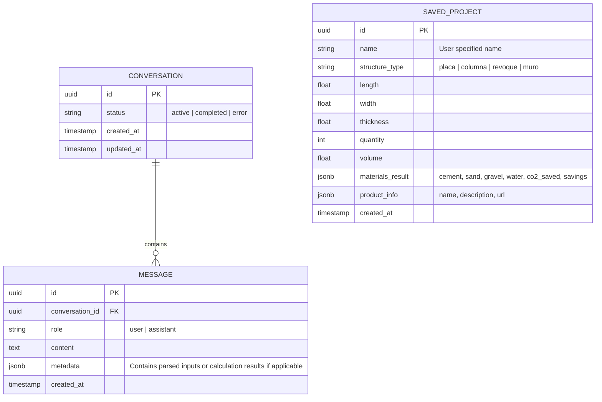

# System Design Document (SDD) - UltraCem Materials Chatbot

This document defines the software design, technical contract, API structures, data schemas, and domain patterns for the **UltraCem Materials Calculator Chatbot**.

---

## 1. Domain-Driven Architecture & Models

Our system is structured under a **Domain-Driven Design (DDD)** approach optimized for Next.js, emphasizing clean boundaries, functional utility pipelines, and strong typing.

### 1.1 Mermaid Architecture & Entity-Relationship Model



### 1.2 Database Schema (Supabase PostgreSQL DDL)

```sql
-- Enable UUID extension
create extension if not exists "uuid-ossp";

-- Define custom types/constraints
create type structure_type_enum as enum ('placa', 'columna', 'revoque', 'muro');
create type chat_role_enum as enum ('user', 'assistant');
create type conversation_status_enum as enum ('active', 'completed', 'error');

-- Conversations Table
create table public.conversations (
    id uuid default uuid_generate_v4() primary key,
    status conversation_status_enum default 'active'::conversation_status_enum not null,
    created_at timestamp with time zone default timezone('utc'::text, now()) not null,
    updated_at timestamp with time zone default timezone('utc'::text, now()) not null
);

-- Messages Table
create table public.messages (
    id uuid default uuid_generate_v4() primary key,
    conversation_id uuid references public.conversations(id) on delete cascade not null,
    role chat_role_enum not null,
    content text not null,
    metadata jsonb default '{}'::jsonb,
    created_at timestamp with time zone default timezone('utc'::text, now()) not null
);

-- Saved Projects Table
create table public.saved_projects (
    id uuid default uuid_generate_v4() primary key,
    name varchar(255) not null,
    structure_type structure_type_enum not null,
    length numeric(10,2) not null,
    width numeric(10,2) not null,
    thickness numeric(10,2) not null,
    quantity integer default 1,
    volume numeric(10,3) not null,
    materials_result jsonb not null, -- { cement (bags), sand (m³), gravel (m³), water (L), co2Saved (kg), savings (COP) }
    product_info jsonb not null,     -- { name, description, url }
    created_at timestamp with time zone default timezone('utc'::text, now()) not null
);

-- Performance Indexes
create index idx_messages_conversation_id on public.messages(conversation_id);
create index idx_saved_projects_created_at on public.saved_projects(created_at);
```

---

## 2. Use Case Logic & Functional Contracts

Our processing pipeline operates on **functional purity**, separating parsing, calculations, and data persistence into deterministic stages.

### 2.1 Domain Flow

```
User Input (Text / Colombian Slang)
      │
      ▼
Gemini LLM NLP Parser (Structured Output Mode)
      │
      ├─► [SUCCESS] Extraction: ConstructionInput (Structure type, Dimensions in meters)
      │      │
      │      ▼
      │   lib/calculateMaterials (Pure functional calculation)
      │      │
      │      ▼
      │   Output Result JSON + Specific UltraCem Product Recommendation
      │
      └─► [INCOMPLETE/AMBIGUOUS] Formulate target clarification prompt
```

### 2.2 Extraction Protocol (Gemini Structured Output API)

We instruct Gemini (using `gemini-2.5-flash` or newer supporting JSON Schema response types) to parse natural Colombian construction expressions into standard JSON structure.

#### Extraction Target Schema:
```json
{
  "type": "object",
  "properties": {
    "structure_type": {
      "type": "string",
      "enum": ["placa", "columna", "revoque", "muro"],
      "description": "The category of construction requested. Match colloquial terms: 'losa'/'plancha' -> 'placa', 'pilar'/'poste' -> 'columna', 'pañete'/'friso' -> 'revoque', 'pared'/'bloques' -> 'muro'."
    },
    "length": {
      "type": "number",
      "description": "Length component in meters. Convert centimeters (e.g. '80 cm' -> 0.8) or feet into meters."
    },
    "width": {
      "type": "number",
      "description": "Width or base component in meters. In columns, could represent base length or diameter."
    },
    "thickness": {
      "type": "number",
      "description": "Thickness, height, or thickness layer in meters. Standardize dimensions (e.g., 'espesor de 12cm' -> 0.12, 'alto de 3m' -> 3.0, 'pañete de 2cm' -> 0.02)."
    },
    "quantity": {
      "type": "integer",
      "description": "Number of columns or items if specified. Default to 1."
    },
    "is_complete": {
      "type": "boolean",
      "description": "True only if all structural dimensions needed for calculation are explicitly declared or reliably implied."
    },
    "missing_parameters": {
      "type": "array",
      "items": { "type": "string" },
      "description": "List of variables missing. Options: ['structure_type', 'length', 'width', 'thickness']."
    }
  },
  "required": ["structure_type", "is_complete", "missing_parameters"]
}
```

---

## 3. Critical Business & Calculation Rules

### 3.1 Material Ratios Configuration Matrix (`RATIOS`)

The calculation relies on specific engineering standards adjusted for standard residential construction under the NSR-10 Colombian building code:

| Structure Type | Target Strength | Cement per $m^3$ (50kg bags) | Sand per $m^3$ ($m^3$) | Gravel per $m^3$ ($m^3$) | Water per $m^3$ (Liters) | CO2 Savings Rate | Average Bag Cost (COP) | Savings Factor |
| :--- | :--- | :--- | :--- | :--- | :--- | :--- | :--- | :--- |
| **Placa** (Losa) | 3,000 PSI | 8.5 bags | $0.45\ m^3$ | $0.55\ m^3$ | 180 L | 40% (0.4) | $28,000 COP | 15% (0.15) |
| **Columna** | 4,000 PSI | 9.0 bags | $0.42\ m^3$ | $0.58\ m^3$ | 190 L | 40% (0.4) | $28,000 COP | 15% (0.15) |
| **Revoque** (Pañete) | N/A | 7.0 bags | $0.96\ m^3$ | $0.00\ m^3$ | 140 L | 35% (0.35) | $26,500 COP | 12% (0.12) |
| **Muro** (Pega) | N/A | 6.5 bags | $0.85\ m^3$ | $0.00\ m^3$ | 120 L | 35% (0.35) | $26,500 COP | 12% (0.12) |

### 3.2 Volume Estimation Calculations
- **Placa / Columna / Revoque**: $\text{Volume } (m^3) = \text{length} \times \text{width} \times \text{thickness} \times \text{quantity}$
- **Muro**: $\text{Volume } (m^3) = \text{length} \times \text{width} \times \text{thickness}$ (where width represents wall height, thickness represents mortar layer/block joint factor, or standard volumetric mortar multiplier).

### 3.3 Dynamic Output Precision
- **Cement**: Always rounded **UP** using `Math.ceil` (users cannot buy fractions of bags).
- **Sand / Gravel**: Rounded to **2 decimal places** (`toFixed(2)`).
- **Water**: Rounded to the nearest Liter (`Math.ceil`).
- **Savings (COP)**: Rounded to nearest thousand or exact peso, calculated as:
  $$\text{Savings} = \text{cement bags} \times \text{cost per bag} \times \text{savings factor}$$
- **CO2 Saved (kg)**: Saved $CO_2$ footprint vs standard low-efficiency cement blends.
  $$\text{CO2 Saved} = \text{cement bags} \times \text{CO2 factor per sack} \times \text{CO2 savings rate}$$

### 3.4 Dimension Boundary Guardrails (Validations)

To prevent ridiculous inputs or calculation bugs:

| Parameter | Minimum Value | Maximum Value | Action on Violation |
| :--- | :--- | :--- | :--- |
| **Length** | 0.1 meters | 100.0 meters | Flag error: "Por favor ingresa una longitud válida entre 10cm y 100m." |
| **Width** | 0.1 meters | 100.0 meters | Flag error: "Por favor ingresa un ancho válido entre 10cm y 100m." |
| **Thickness** | 0.01 meters (1cm) | 2.0 meters | Flag error: "El espesor debe estar entre 1cm y 2 metros." |
| **Quantity** | 1 | 200 | Flag error: "La cantidad máxima de elementos es de 200 unidades." |

---

## 4. UI/UX Flow & Atomic Components (Mobile-First)

The design is strictly **mobile-first**, mirroring familiar chat interfaces (WhatsApp, Telegram) to minimize cognitive resistance for site foremen ("maestros de obra").

### 4.1 Interface Layout Hierarchy

1. **Header Component**: Brand colors (UltraCem Yellow & Blue), instant contact hook, active calculator state indicator.
2. **Conversation Stream**:
   - **System/Assistant Bubble**: Conversational, friendly, Colombian construction jargon-friendly style. Uses clear iconography.
   - **User Bubble**: Right-aligned, minimal.
   - **Interactive Quick-Onboarding Options**: Block buttons for fast structure type selection to avoid writing initially.
3. **Interactive Result Card**: Renders dynamically inside the chat stream when a calculation completes. Includes:
   - **Accordion tabs** or clean badges with material breakdowns (cement, sand, gravel, water).
   - **Recommended UltraCem Product Card** with product image placeholder, click-through button to product datasheet, and structured list of benefits.
   - **Value Cards**: High-impact "Ahorro Estimado (COP)" with gold coloring and "Impacto Ambiental" with green badges.
4. **Chat Input Area**: Fixed at bottom, includes:
   - Floating quick-suggest templates ("Placa de 6x5 de 10cm", "Revoque de 20m2").
   - Actionable send button.

### 4.2 State Handling & Edge Cases

- **Loading State**: A specialized "typing indicator" showing an animated skeleton or three-dot pulse with micro-copy such as `"Asistente de Obra está calculando los materiales..."` or `"Revisando dosificaciones de UltraCem..."`.
- **API Failure Hook**: If the Gemini API limits out or fails, gracefully display:
  `"¡Uy, qué pena! Tuvimos un inconveniente calculando tus datos. No te preocupes, puedes usar nuestras opciones rápidas o ingresar las dimensiones de nuevo."`
- **Ambiguity Resolver (Conversational Loop)**: If `is_complete` is false, the engine responds directly targeting the first missing property:
  - If missing structure type: `"¿Qué vamos a fundir hoy? Puedes elegir: Placa, Columna, Revoque o Muro."`
  - If missing thickness: `"¿De qué espesor va a ser la placa? Lo estándar para casas son 10cm o 12cm."`
