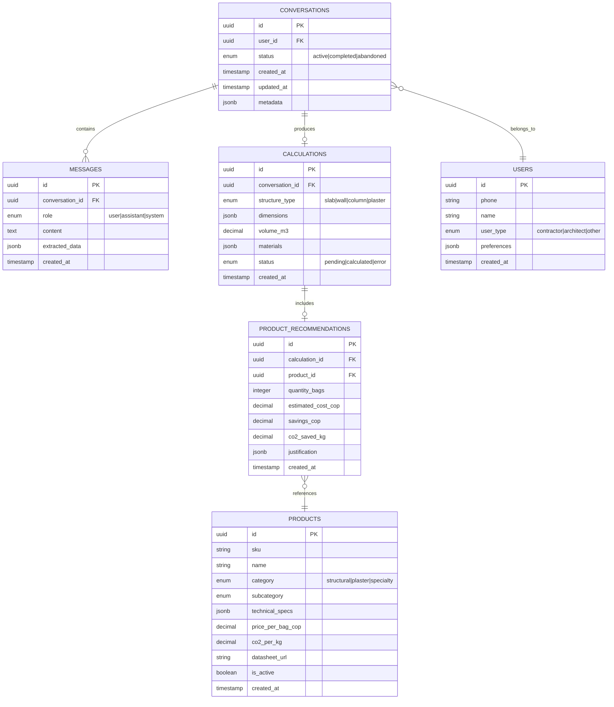
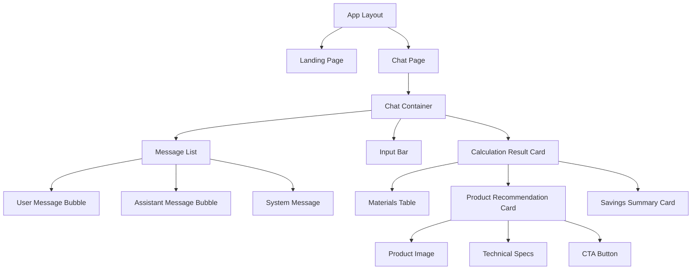
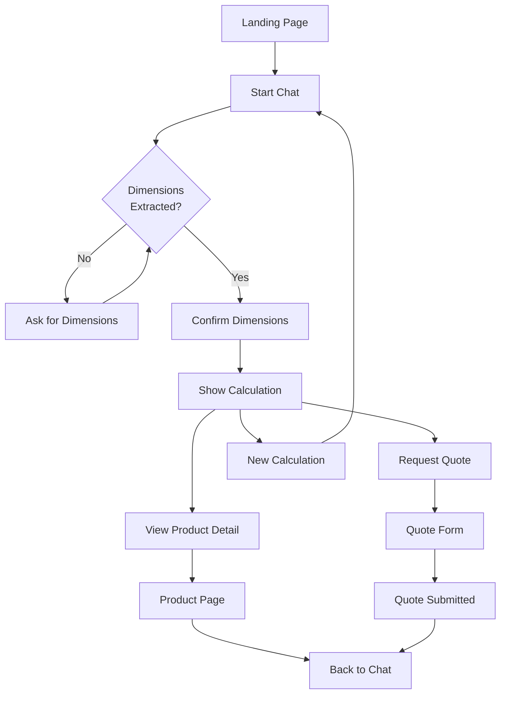
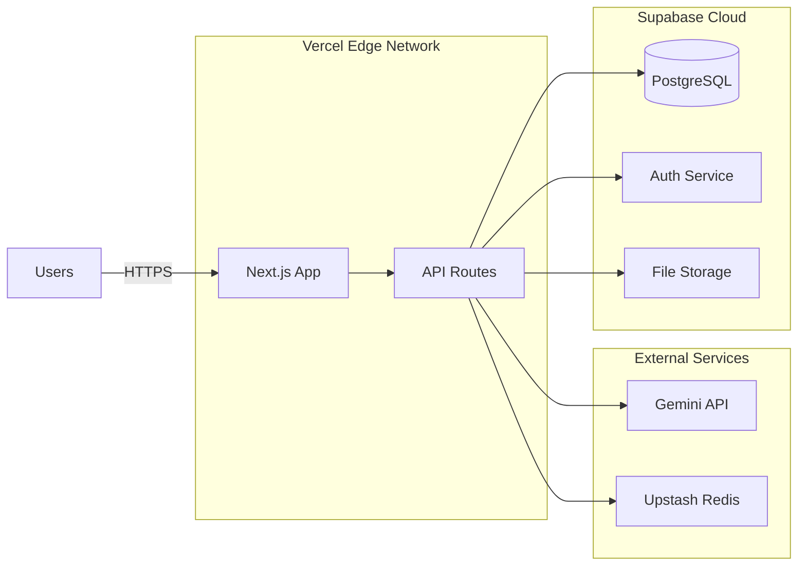

# UltraCem Chatbot - Technical Specification Document (SDD)
**Version:** 1.0
**Date:** May 23, 2026
**Stack:** Next.js 14+ (App Router), Supabase, Tailwind CSS, Gemini API
**Architecture:** Domain-Driven Design (DDD)
**Target:** Mobile-First Progressive Web App

---

## Table of Contents
1. [System Overview](#1-system-overview)
2. [Data Models & Schema](#2-data-models--schema)
3. [Domain Logic & Business Rules](#3-domain-logic--business-rules)
4. [API Contracts](#4-api-contracts)
5. [UI/UX Architecture](#5-uiux-architecture)
6. [State Management](#6-state-management)
7. [Error Handling & Edge Cases](#7-error-handling--edge-cases)
8. [Performance Requirements](#8-performance-requirements)
9. [Security & Compliance](#9-security--compliance)

---

## 1. System Overview

### 1.1 High-Level Architecture

```mermaid
graph TB
    subgraph "Client Layer - Next.js"
        UI[Mobile UI Components]
        State[Client State - Zustand]
        API_Client[API Client Layer]
    end

    subgraph "API Layer - Next.js API Routes"
        Chat_API[/api/chat/send]
        Calc_API[/api/calculate]
        Products_API[/api/products]
        Analytics_API[/api/analytics]
    end

    subgraph "Business Logic Layer"
        NLP[NLP Service - Gemini]
        Calculator[Material Calculator]
        ProductMatcher[Product Recommendation Engine]
        CostEstimator[Cost & Environmental Calculator]
    end

    subgraph "Data Layer - Supabase"
        DB[(PostgreSQL)]
        Storage[File Storage]
        Auth[Supabase Auth]
    end

    UI --> API_Client
    API_Client --> Chat_API
    API_Client --> Calc_API
    API_Client --> Products_API

    Chat_API --> NLP
    Calc_API --> Calculator
    Calc_API --> ProductMatcher
    Calc_API --> CostEstimator

    Products_API --> DB
    NLP --> DB
    Calculator --> DB
    ProductMatcher --> DB

    DB --> Storage
    DB --> Auth
```

### 1.2 Tech Stack Justification

| Technology | Purpose | Why This Choice |
|-----------|---------|-----------------|
| **Next.js 14+ (App Router)** | Frontend + API Routes | Server Components for initial load performance, API routes for serverless functions, built-in SEO optimization |
| **Supabase** | Database + Auth + Realtime | PostgreSQL for relational data, Row Level Security, realtime subscriptions for chat, generous free tier |
| **Tailwind CSS** | Styling | Mobile-first utility classes, component variants, minimal bundle size |
| **Gemini API (gemini-3.1-flash)** | NLP Engine | Fast response times (< 2s), strong Spanish language support, cost-effective for MVP, function calling for structured output |
| **Zustand** | Client State | Lightweight (< 1kb), TypeScript-first, no boilerplate |

---

## 2. Data Models & Schema

### 2.1 Entity Relationship Diagram



### 2.2 Supabase Schema (PostgreSQL)

```sql
-- Enable UUID extension
CREATE EXTENSION IF NOT EXISTS "uuid-ossp";

-- Users table (extends Supabase auth.users)
CREATE TABLE public.users (
  id UUID PRIMARY KEY REFERENCES auth.users(id) ON DELETE CASCADE,
  phone VARCHAR(20) UNIQUE,
  name VARCHAR(255),
  user_type VARCHAR(50) CHECK (user_type IN ('contractor', 'architect', 'other')),
  preferences JSONB DEFAULT '{}',
  created_at TIMESTAMP WITH TIME ZONE DEFAULT NOW(),
  updated_at TIMESTAMP WITH TIME ZONE DEFAULT NOW()
);

-- Conversations table
CREATE TABLE public.conversations (
  id UUID PRIMARY KEY DEFAULT uuid_generate_v4(),
  user_id UUID REFERENCES public.users(id) ON DELETE SET NULL,
  status VARCHAR(20) CHECK (status IN ('active', 'completed', 'abandoned')) DEFAULT 'active',
  metadata JSONB DEFAULT '{}',
  created_at TIMESTAMP WITH TIME ZONE DEFAULT NOW(),
  updated_at TIMESTAMP WITH TIME ZONE DEFAULT NOW()
);

-- Messages table
CREATE TABLE public.messages (
  id UUID PRIMARY KEY DEFAULT uuid_generate_v4(),
  conversation_id UUID NOT NULL REFERENCES public.conversations(id) ON DELETE CASCADE,
  role VARCHAR(20) CHECK (role IN ('user', 'assistant', 'system')) NOT NULL,
  content TEXT NOT NULL,
  extracted_data JSONB DEFAULT '{}',
  created_at TIMESTAMP WITH TIME ZONE DEFAULT NOW()
);

-- Products table
CREATE TABLE public.products (
  id UUID PRIMARY KEY DEFAULT uuid_generate_v4(),
  sku VARCHAR(50) UNIQUE NOT NULL,
  name VARCHAR(255) NOT NULL,
  category VARCHAR(50) CHECK (category IN ('structural', 'plaster', 'specialty')) NOT NULL,
  subcategory VARCHAR(50),
  technical_specs JSONB NOT NULL DEFAULT '{}',
  price_per_bag_cop DECIMAL(10, 2) NOT NULL,
  co2_per_kg DECIMAL(5, 3) DEFAULT 0.900,
  datasheet_url TEXT,
  is_active BOOLEAN DEFAULT TRUE,
  created_at TIMESTAMP WITH TIME ZONE DEFAULT NOW(),
  updated_at TIMESTAMP WITH TIME ZONE DEFAULT NOW()
);

-- Calculations table
CREATE TABLE public.calculations (
  id UUID PRIMARY KEY DEFAULT uuid_generate_v4(),
  conversation_id UUID NOT NULL REFERENCES public.conversations(id) ON DELETE CASCADE,
  structure_type VARCHAR(20) CHECK (structure_type IN ('slab', 'wall', 'column', 'plaster')) NOT NULL,
  dimensions JSONB NOT NULL,
  volume_m3 DECIMAL(10, 3),
  materials JSONB,
  status VARCHAR(20) CHECK (status IN ('pending', 'calculated', 'error')) DEFAULT 'pending',
  created_at TIMESTAMP WITH TIME ZONE DEFAULT NOW()
);

-- Product Recommendations table
CREATE TABLE public.product_recommendations (
  id UUID PRIMARY KEY DEFAULT uuid_generate_v4(),
  calculation_id UUID NOT NULL REFERENCES public.calculations(id) ON DELETE CASCADE,
  product_id UUID NOT NULL REFERENCES public.products(id) ON DELETE RESTRICT,
  quantity_bags INTEGER NOT NULL,
  estimated_cost_cop DECIMAL(12, 2) NOT NULL,
  savings_cop DECIMAL(12, 2) DEFAULT 0,
  co2_saved_kg DECIMAL(8, 2) DEFAULT 0,
  justification JSONB,
  created_at TIMESTAMP WITH TIME ZONE DEFAULT NOW()
);

-- Indexes for performance
CREATE INDEX idx_conversations_user_id ON public.conversations(user_id);
CREATE INDEX idx_conversations_status ON public.conversations(status);
CREATE INDEX idx_messages_conversation_id ON public.messages(conversation_id);
CREATE INDEX idx_calculations_conversation_id ON public.calculations(conversation_id);
CREATE INDEX idx_product_recommendations_calculation_id ON public.product_recommendations(calculation_id);
CREATE INDEX idx_products_category ON public.products(category);
CREATE INDEX idx_products_is_active ON public.products(is_active);

-- Row Level Security (RLS)
ALTER TABLE public.users ENABLE ROW LEVEL SECURITY;
ALTER TABLE public.conversations ENABLE ROW LEVEL SECURITY;
ALTER TABLE public.messages ENABLE ROW LEVEL SECURITY;
ALTER TABLE public.calculations ENABLE ROW LEVEL SECURITY;
ALTER TABLE public.product_recommendations ENABLE ROW LEVEL SECURITY;

-- RLS Policies
CREATE POLICY "Users can read own profile" ON public.users
  FOR SELECT USING (auth.uid() = id);

CREATE POLICY "Users can update own profile" ON public.users
  FOR UPDATE USING (auth.uid() = id);

CREATE POLICY "Users can read own conversations" ON public.conversations
  FOR SELECT USING (auth.uid() = user_id OR user_id IS NULL);

CREATE POLICY "Users can insert own conversations" ON public.conversations
  FOR INSERT WITH CHECK (auth.uid() = user_id OR user_id IS NULL);

CREATE POLICY "Users can read messages from own conversations" ON public.messages
  FOR SELECT USING (
    conversation_id IN (
      SELECT id FROM public.conversations WHERE user_id = auth.uid() OR user_id IS NULL
    )
  );

-- Public read access for products (guest users can browse)
CREATE POLICY "Anyone can read active products" ON public.products
  FOR SELECT USING (is_active = TRUE);
```

### 2.3 TypeScript Type Definitions

```typescript
// src/types/database.types.ts

export type StructureType = 'slab' | 'wall' | 'column' | 'plaster';
export type ConversationStatus = 'active' | 'completed' | 'abandoned';
export type MessageRole = 'user' | 'assistant' | 'system';
export type CalculationStatus = 'pending' | 'calculated' | 'error';
export type ProductCategory = 'structural' | 'plaster' | 'specialty';
export type UserType = 'contractor' | 'architect' | 'other';

export interface Dimensions {
  length_m: number;
  width_m?: number;
  height_m?: number;
  thickness_m?: number;
  diameter_m?: number;
  area_m2?: number;
}

export interface Materials {
  cement_bags_50kg: number;
  sand_m3: number;
  gravel_m3?: number;
  water_liters: number;
}

export interface TechnicalSpecs {
  resistance_psi?: number;
  setting_time_hours?: number;
  coverage_m2_per_bag?: number;
  cement_content_kg_per_m3?: number;
  water_cement_ratio?: number;
}

export interface ProductJustification {
  technical_reason: string;
  economic_reason: string;
  environmental_reason?: string;
}

// Database Tables
export interface User {
  id: string;
  phone: string | null;
  name: string | null;
  user_type: UserType | null;
  preferences: Record<string, unknown>;
  created_at: string;
  updated_at: string;
}

export interface Conversation {
  id: string;
  user_id: string | null;
  status: ConversationStatus;
  metadata: Record<string, unknown>;
  created_at: string;
  updated_at: string;
}

export interface Message {
  id: string;
  conversation_id: string;
  role: MessageRole;
  content: string;
  extracted_data: Record<string, unknown>;
  created_at: string;
}

export interface Calculation {
  id: string;
  conversation_id: string;
  structure_type: StructureType;
  dimensions: Dimensions;
  volume_m3: number | null;
  materials: Materials | null;
  status: CalculationStatus;
  created_at: string;
}

export interface Product {
  id: string;
  sku: string;
  name: string;
  category: ProductCategory;
  subcategory: string | null;
  technical_specs: TechnicalSpecs;
  price_per_bag_cop: number;
  co2_per_kg: number;
  datasheet_url: string | null;
  is_active: boolean;
  created_at: string;
  updated_at: string;
}

export interface ProductRecommendation {
  id: string;
  calculation_id: string;
  product_id: string;
  quantity_bags: number;
  estimated_cost_cop: number;
  savings_cop: number;
  co2_saved_kg: number;
  justification: ProductJustification | null;
  created_at: string;
}
```

---

## 3. Domain Logic & Business Rules

### 3.1 Material Calculation Engine

#### 3.1.1 Core Formulas (Based on NSR-10 Colombia Standards)

```typescript
// src/domains/calculation/calculator.service.ts

interface CalculationInput {
  structureType: StructureType;
  dimensions: Dimensions;
  resistancePsi?: number;
}

interface CalculationResult {
  volume_m3: number;
  materials: Materials;
  metadata: {
    formula_used: string;
    waste_factor: number;
  };
}

export class MaterialCalculator {
  // Dosage tables (cement kg per m³ of concrete)
  private readonly DOSAGE_TABLE = {
    slab_3000psi: 350, // kg cement per m³
    slab_4000psi: 420,
    wall_3000psi: 300,
    column_3000psi: 380,
    column_4000psi: 450,
    plaster: 280,
  };

  // Material ratios (for standard concrete mix)
  private readonly MATERIAL_RATIOS = {
    cement_sand_gravel: {
      cement: 1,
      sand: 2,
      gravel: 3,
    },
    cement_sand: {
      cement: 1,
      sand: 3,
    },
  };

  // Waste factors
  private readonly WASTE_FACTORS = {
    slab: 1.05, // 5% waste
    wall: 1.10, // 10% waste
    column: 1.08,
    plaster: 1.15,
  };

  /**
   * Main calculation method
   * @throws {ValidationError} if dimensions are invalid
   */
  calculate(input: CalculationInput): CalculationResult {
    // 1. Validate input
    this.validateInput(input);

    // 2. Calculate volume
    const volume_m3 = this.calculateVolume(
      input.structureType,
      input.dimensions
    );

    // 3. Apply waste factor
    const adjustedVolume =
      volume_m3 * this.WASTE_FACTORS[input.structureType];

    // 4. Calculate materials
    const materials = this.calculateMaterials(
      input.structureType,
      adjustedVolume,
      input.resistancePsi
    );

    return {
      volume_m3: adjustedVolume,
      materials,
      metadata: {
        formula_used: this.getFormulaName(input.structureType, input.resistancePsi),
        waste_factor: this.WASTE_FACTORS[input.structureType],
      },
    };
  }

  private calculateVolume(
    type: StructureType,
    dims: Dimensions
  ): number {
    switch (type) {
      case 'slab':
        // Volume = length × width × thickness
        if (!dims.length_m || !dims.width_m || !dims.thickness_m) {
          throw new ValidationError(
            'Slab requires length, width, and thickness'
          );
        }
        return dims.length_m * dims.width_m * dims.thickness_m;

      case 'wall':
        // Volume = length × height × thickness
        if (!dims.length_m || !dims.height_m || !dims.thickness_m) {
          throw new ValidationError(
            'Wall requires length, height, and thickness'
          );
        }
        return dims.length_m * dims.height_m * dims.thickness_m;

      case 'column':
        if (dims.diameter_m) {
          // Circular column: π × r² × height
          const radius = dims.diameter_m / 2;
          if (!dims.height_m) {
            throw new ValidationError('Column requires height');
          }
          return Math.PI * Math.pow(radius, 2) * dims.height_m;
        } else if (dims.length_m && dims.width_m) {
          // Square column: base × base × height
          if (!dims.height_m) {
            throw new ValidationError('Column requires height');
          }
          return dims.length_m * dims.width_m * dims.height_m;
        }
        throw new ValidationError(
          'Column requires diameter or base dimensions'
        );

      case 'plaster':
        // Volume = area × thickness
        if (!dims.area_m2 || !dims.thickness_m) {
          throw new ValidationError(
            'Plaster requires area and thickness'
          );
        }
        return dims.area_m2 * dims.thickness_m;

      default:
        throw new ValidationError(`Unknown structure type: ${type}`);
    }
  }

  private calculateMaterials(
    type: StructureType,
    volume_m3: number,
    resistancePsi: number = 3000
  ): Materials {
    // Get cement dosage
    const dosageKey = this.getDosageKey(type, resistancePsi);
    const cementKgPerM3 = this.DOSAGE_TABLE[dosageKey];
    const totalCementKg = cementKgPerM3 * volume_m3;
    const cementBags50kg = Math.ceil(totalCementKg / 50);

    // Calculate sand and gravel based on ratios
    let sand_m3: number;
    let gravel_m3: number | undefined;
    let water_liters: number;

    if (type === 'plaster' || type === 'wall') {
      // Cement-sand mortar (1:3)
      const ratio = this.MATERIAL_RATIOS.cement_sand;
      sand_m3 = (cementKgPerM3 / 1500) * ratio.sand * volume_m3; // 1500 kg/m³ is cement density
      water_liters = cementKgPerM3 * 0.5 * volume_m3; // Water-cement ratio 0.5
    } else {
      // Concrete (1:2:3)
      const ratio = this.MATERIAL_RATIOS.cement_sand_gravel;
      sand_m3 = (cementKgPerM3 / 1500) * ratio.sand * volume_m3;
      gravel_m3 = (cementKgPerM3 / 1500) * ratio.gravel * volume_m3;
      water_liters = cementKgPerM3 * 0.55 * volume_m3; // Water-cement ratio 0.55
    }

    return {
      cement_bags_50kg: cementBags50kg,
      sand_m3: parseFloat(sand_m3.toFixed(2)),
      gravel_m3: gravel_m3 ? parseFloat(gravel_m3.toFixed(2)) : undefined,
      water_liters: Math.round(water_liters),
    };
  }

  private getDosageKey(type: StructureType, resistancePsi: number): string {
    const resistance = resistancePsi >= 4000 ? '4000psi' : '3000psi';

    switch (type) {
      case 'slab':
        return `slab_${resistance}`;
      case 'column':
        return `column_${resistance}`;
      case 'wall':
        return 'wall_3000psi';
      case 'plaster':
        return 'plaster';
      default:
        return 'slab_3000psi';
    }
  }

  private validateInput(input: CalculationInput): void {
    // Validate structure type
    if (!['slab', 'wall', 'column', 'plaster'].includes(input.structureType)) {
      throw new ValidationError('Invalid structure type');
    }

    // Validate dimensions are positive
    const dims = input.dimensions;
    const values = Object.values(dims).filter(v => v !== undefined);

    if (values.some(v => v! <= 0)) {
      throw new ValidationError('All dimensions must be positive numbers');
    }

    // Validate dimension ranges
    if (dims.length_m && (dims.length_m < 0.1 || dims.length_m > 50)) {
      throw new ValidationError('Length must be between 0.1m and 50m');
    }

    if (dims.thickness_m && (dims.thickness_m < 0.02 || dims.thickness_m > 1)) {
      throw new ValidationError('Thickness must be between 2cm and 1m');
    }
  }

  private getFormulaName(type: StructureType, resistancePsi?: number): string {
    return `${type}_${resistancePsi || 3000}psi`;
  }
}

class ValidationError extends Error {
  constructor(message: string) {
    super(message);
    this.name = 'ValidationError';
  }
}
```

### 3.2 Product Recommendation Engine

```typescript
// src/domains/recommendation/product-matcher.service.ts

export interface RecommendationInput {
  structureType: StructureType;
  materials: Materials;
  resistancePsi: number;
  isQuickProject?: boolean;
}

export interface RecommendationOutput {
  product: Product;
  quantity_bags: number;
  estimated_cost_cop: number;
  savings_cop: number;
  co2_saved_kg: number;
  justification: ProductJustification;
}

export class ProductMatcher {
  constructor(private supabase: SupabaseClient) {}

  /**
   * Matches optimal UltraCem product based on project requirements
   */
  async recommend(
    input: RecommendationInput
  ): Promise<RecommendationOutput> {
    // 1. Get candidate products
    const candidates = await this.getCandidateProducts(input.structureType);

    // 2. Score and rank products
    const scoredProducts = this.scoreProducts(candidates, input);

    // 3. Select best product
    const bestProduct = scoredProducts;

    // 4. Calculate costs and savings
    const costAnalysis = this.calculateCostAnalysis(
      bestProduct.product,
      input.materials,
      input.structureType
    );

    // 5. Generate justification
    const justification = this.generateJustification(
      bestProduct.product,
      input,
      costAnalysis
    );

    return {
      product: bestProduct.product,
      quantity_bags: input.materials.cement_bags_50kg,
      ...costAnalysis,
      justification,
    };
  }

  private async getCandidateProducts(
    type: StructureType
  ): Promise<Product[]> {
    const categoryMap: Record<StructureType, ProductCategory> = {
      slab: 'structural',
      column: 'structural',
      wall: 'specialty',
      plaster: 'plaster',
    };

    const { data, error } = await this.supabase
      .from('products')
      .select('*')
      .eq('category', categoryMap[type])
      .eq('is_active', true);

    if (error) throw error;
    return data as Product[];
  }

  private scoreProducts(
    products: Product[],
    input: RecommendationInput
  ): Array<{ product: Product; score: number }> {
    const scored = products.map(product => {
      let score = 0;

      // Score based on resistance match
      const specs = product.technical_specs;
      if (specs.resistance_psi) {
        const resistanceDiff = Math.abs(
          specs.resistance_psi - input.resistancePsi
        );
        score += resistanceDiff < 500 ? 10 : resistanceDiff < 1000 ? 5 : 0;
      }

      // Score for quick setting if needed
      if (input.isQuickProject && specs.setting_time_hours) {
        score += specs.setting_time_hours < 6 ? 15 : specs.setting_time_hours < 12 ? 8 : 0;
      }

      // Score for environmental friendliness
      score += product.co2_per_kg < 0.850 ? 5 : 0;

      return { product, score };
    });

    return scored.sort((a, b) => b.score - a.score);
  }

  private calculateCostAnalysis(
    product: Product,
    materials: Materials,
    structureType: StructureType
  ): {
    estimated_cost_cop: number;
    savings_cop: number;
    co2_saved_kg: number;
  } {
    const quantityBags = materials.cement_bags_50kg;

    // Calculate optimal cost
    const estimated_cost_cop = quantityBags * product.price_per_bag_cop;

    // Calculate typical overbuying cost (20% more)
    const typical_overbuying_cost = estimated_cost_cop * 1.20;
    const savings_cop = typical_overbuying_cost - estimated_cost_cop;

    // Calculate CO2 saved vs generic cement (0.95 kg CO2 per kg cement)
    const generic_co2_per_kg = 0.950;
    const ultracem_co2_per_kg = product.co2_per_kg;
    const co2_diff_per_kg = generic_co2_per_kg - ultracem_co2_per_kg;
    const total_cement_kg = quantityBags * 50;
    const co2_saved_kg = co2_diff_per_kg * total_cement_kg;

    return {
      estimated_cost_cop,
      savings_cop,
      co2_saved_kg: Math.max(0, co2_saved_kg),
    };
  }

  private generateJustification(
    product: Product,
    input: RecommendationInput,
    costAnalysis: { savings_cop: number; co2_saved_kg: number }
  ): ProductJustification {
    const specs = product.technical_specs;

    let technical_reason = '';
    let economic_reason = '';
    let environmental_reason = '';

    // Technical justification
    if (input.structureType === 'slab' || input.structureType === 'column') {
      technical_reason = `Resistencia certificada de ${specs.resistance_psi} PSI, ideal para ${input.structureType === 'slab' ? 'placas' : 'columnas'} residenciales. Fraguado optimizado en ${specs.setting_time_hours}h permite continuar trabajo rápidamente.`;
    } else if (input.structureType === 'wall') {
      technical_reason = `Formulación específica para pegado de bloques, con excelente adherencia y menor retracción.`;
    } else {
      technical_reason = `Mezcla optimizada para revoques, con acabado liso y sin fisuras. Cobertura de ${specs.coverage_m2_per_bag} m² por bulto.`;
    }

    // Economic justification
    const savingsFormatted = new Intl.NumberFormat('es-CO', {
      style: 'currency',
      currency: 'COP',
      maximumFractionDigits: 0,
    }).format(costAnalysis.savings_cop);

    economic_reason = `Ahorro de ${savingsFormatted} al comprar cantidad exacta vs sobrecompra habitual del 20%. Precio competitivo: ${new Intl.NumberFormat('es-CO', {
      style: 'currency',
      currency: 'COP',
      maximumFractionDigits: 0,
    }).format(product.price_per_bag_cop)} por bulto.`;

    // Environmental justification
    if (costAnalysis.co2_saved_kg > 0) {
      const trees_equivalent = Math.round(costAnalysis.co2_saved_kg / 15);
      environmental_reason = `Reduce ${Math.round(costAnalysis.co2_saved_kg)} kg de CO₂ vs cemento genérico (equivalente a ${trees_equivalent} árboles plantados).`;
    }

    return {
      technical_reason,
      economic_reason,
      environmental_reason,
    };
  }
}
```

### 3.3 NLP Conversation Manager (Gemini Integration)

```typescript
// src/domains/conversation/nlp.service.ts

import { GoogleGenerativeAI } from '@google/generative-ai';

export interface ConversationContext {
  conversationId: string;
  messageHistory: Message[];
  extractedData: Partial<CalculationInput>;
}

export interface NLPResponse {
  reply: string;
  intent: 'greeting' | 'dimension_extraction' | 'confirmation' | 'calculation' | 'unknown';
  extractedData?: Partial<CalculationInput>;
  isReadyForCalculation: boolean;
}

export class NLPService {
  private genAI: GoogleGenerativeAI;
  private model;

  constructor(apiKey: string) {
    this.genAI = new GoogleGenerativeAI(apiKey);
    this.model = this.genAI.getGenerativeModel({
      model: 'gemini-3.1-flash',
      generationConfig: {
        temperature: 0.3, // Lower temperature for more consistent outputs
        maxOutputTokens: 500,
      }
    });
  }

  /**
   * Process user message and extract construction parameters
   */
  async processMessage(
    userMessage: string,
    context: ConversationContext
  ): Promise<NLPResponse> {
    const prompt = this.buildPrompt(userMessage, context);

    try {
      const result = await this.model.generateContent(prompt);
      const response = await result.response;
      const text = response.text();

      // Parse structured response
      return this.parseGeminiResponse(text, context);
    } catch (error) {
      console.error('Gemini API error:', error);
      return {
        reply: 'Disculpa, tuve un problema procesando tu mensaje. ¿Podrías repetirlo?',
        intent: 'unknown',
        isReadyForCalculation: false,
      };
    }
  }

  private buildPrompt(
    userMessage: string,
    context: ConversationContext
  ): string {
    const systemPrompt = `Eres el Asistente Virtual de UltraCem, una empresa colombiana de cemento. Tu objetivo es ayudar a maestros de obra a calcular materiales de construcción de forma rápida y precisa.

**CONTEXTO:**
- Usuario típico: Maestro de obra colombiano con 20+ años de experiencia
- Lenguaje: Español colombiano coloquial (acepta "fundir", "bulto", "bloque de 15", etc.)
- Objetivo: Extraer dimensiones de estructuras para calcular materiales

**ESTRUCTURAS SOPORTADAS:**
1. PLACA/LOSA: largo × ancho × espesor (ej: "5x4 metros de 10cm")
2. MURO: largo × alto × espesor (ej: "muro de 3m de largo por 2.5 de alto, bloque de 15")
3. COLUMNA: base × base × altura O diámetro × altura (ej: "columna de 30x30 y 3m de altura")
4. REVOQUE: área × espesor (ej: "revocar 50 metros cuadrados con 2cm")

**REGLAS DE EXTRACCIÓN:**
- Convierte todas las unidades a metros (m)
- "bloque de 10" = 0.10m, "bloque de 15" = 0.15m
- Asume metros si no se especifica unidad
- Si falta alguna dimensión crítica, pregunta específicamente
- No más de 3 preguntas antes de calcular

**FORMATO DE RESPUESTA:**
Responde SIEMPRE en este formato JSON:
{
  "reply": "mensaje amigable para el usuario",
  "intent": "greeting|dimension_extraction|confirmation|calculation|unknown",
  "extractedData": {
    "structureType": "slab|wall|column|plaster",
    "dimensions": {
      "length_m": number,
      "width_m": number,
      "height_m": number,
      "thickness_m": number,
      "diameter_m": number,
      "area_m2": number
    },
    "resistancePsi": 3000
  },
  "isReadyForCalculation": boolean
}

**DATOS EXTRAÍDOS HASTA AHORA:**
${JSON.stringify(context.extractedData, null, 2)}

**HISTORIAL DE CONVERSACIÓN:**
${context.messageHistory.slice(-5).map(m => `${m.role}: ${m.content}`).join('\n')}

**MENSAJE DEL USUARIO:**
${userMessage}

**INSTRUCCIONES:**
1. Analiza el mensaje del usuario
2. Extrae o confirma dimensiones
3. Si falta información, pregunta de forma natural
4. Si tienes toda la info, marca isReadyForCalculation=true
5. Responde en JSON válido`;

    return systemPrompt;
  }

  private parseGeminiResponse(
    text: string,
    context: ConversationContext
  ): NLPResponse {
    try {
      // Extract JSON from response (handle markdown code blocks)
      const jsonMatch = text.match(/\{[\s\S]*\}/);
      if (!jsonMatch) {
        throw new Error('No JSON found in response');
      }

      const parsed = JSON.parse(jsonMatch);

      // Merge extracted data with context
      const mergedData = {
        ...context.extractedData,
        ...parsed.extractedData,
      };

      return {
        reply: parsed.reply,
        intent: parsed.intent,
        extractedData: mergedData,
        isReadyForCalculation: parsed.isReadyForCalculation || false,
      };
    } catch (error) {
      console.error('Error parsing Gemini response:', error);
      return {
        reply: text,
        intent: 'unknown',
        isReadyForCalculation: false,
      };
    }
  }

  /**
   * Generate final calculation summary message
   */
  generateSummaryMessage(
    calculation: Calculation,
    recommendation: RecommendationOutput
  ): string {
    const { materials } = calculation;
    const { product, estimated_cost_cop, savings_cop, co2_saved_kg, justification } = recommendation;

    const formatter = new Intl.NumberFormat('es-CO', {
      style: 'currency',
      currency: 'COP',
      maximumFractionDigits: 0,
    });

    return `✅ **MATERIALES CALCULADOS**

📐 **Volumen total:** ${calculation.volume_m3.toFixed(2)} m³

📊 **MATERIALES NECESARIOS:**
-  Cemento: **${materials.cement_bags_50kg} sacos de 50kg**
-  Arena: **${materials.sand_m3} m³**
${materials.gravel_m3 ? `• Grava: **${materials.gravel_m3} m³**\n` : ''}-  Agua: **${materials.water_liters} litros**

***

✅ **PRODUCTO RECOMENDADO:**
## ${product.name}

🔗 [Ver ficha técnica](${product.datasheet_url})

💡 **POR QUÉ ESTE PRODUCTO:**
${justification.technical_reason}

💰 **AHORRO ESTIMADO:**
Costo optimizado: ${formatter.format(estimated_cost_cop)}
Vs. compra con margen de error: ${formatter.format(estimated_cost_cop + savings_cop)}
✅ **AHORRAS: ${formatter.format(savings_cop)}**

${co2_saved_kg > 0 ? `🌱 **BENEFICIO AMBIENTAL:**
CO₂ evitado: ${Math.round(co2_saved_kg)} kg
Equivalente a: ${Math.round(co2_saved_kg / 15)} árboles plantados\n` : ''}
📲 **¿Quieres hacer el pedido?**`;
  }
}
```

### 3.4 Business Rules Summary

| Rule ID | Description | Validation Logic | Error Handling |
|---------|-------------|------------------|----------------|
| **BR-001** | Minimum dimensions | length ≥ 0.1m, thickness ≥ 0.02m | Show error: "Dimensiones muy pequeñas. Verifica tus medidas." |
| **BR-002** | Maximum dimensions | length ≤ 50m, thickness ≤ 1m | Show error: "Dimensiones muy grandes. Para estructuras especiales, contacta un ingeniero." |
| **BR-003** | Required dimensions per type | Slab: L×W×T, Wall: L×H×T, Column: (L×W OR D)×H, Plaster: Area×T | Ask for missing dimension specifically |
| **BR-004** | Minimum cement order | ≥ 3 bags | Warn: "Cantidad muy pequeña. Considera agregar 10% extra." |
| **BR-005** | Conversation timeout | 15 minutes of inactivity | Auto-save state, send reminder after 10 min |
| **BR-006** | Guest user limitations | Max 5 calculations/day without auth | Prompt to create account after 3rd calculation |
| **BR-007** | Product availability | Only recommend is_active=true products | Fallback to generic category recommendation |
| **BR-008** | Price staleness | Product prices updated < 30 days ago | Show disclaimer if prices older than 30 days |

---

## 4. API Contracts

### 4.1 REST API Endpoints

#### POST `/api/chat/send`
**Purpose:** Send user message and receive assistant response

**Request:**
```typescript
{
  conversationId?: string; // Optional, creates new if omitted
  message: string;
  userId?: string; // Optional for guest users
}
```

**Response:**
```typescript
{
  success: boolean;
  data: {
    conversationId: string;
    messageId: string;
    reply: string;
    isReadyForCalculation: boolean;
    extractedData?: Partial<CalculationInput>;
  };
  error?: string;
}
```

**Status Codes:**
- `200` - Success
- `400` - Invalid input
- `429` - Rate limit exceeded
- `500` - Server error

---

#### POST `/api/calculate`
**Purpose:** Perform material calculation and get product recommendation

**Request:**
```typescript
{
  conversationId: string;
  structureType: StructureType;
  dimensions: Dimensions;
  resistancePsi?: number; // Default: 3000
}
```

**Response:**
```typescript
{
  success: boolean;
  data: {
    calculation: {
      id: string;
      volume_m3: number;
      materials: Materials;
    };
    recommendation: {
      product: Product;
      quantity_bags: number;
      estimated_cost_cop: number;
      savings_cop: number;
      co2_saved_kg: number;
      justification: ProductJustification;
    };
    summaryMessage: string; // Formatted markdown
  };
  error?: string;
}
```

**Status Codes:**
- `200` - Success
- `400` - Invalid dimensions
- `404` - Conversation not found
- `500` - Calculation error

---

#### GET `/api/products`
**Purpose:** List available UltraCem products

**Query Params:**
```typescript
{
  category?: ProductCategory;
  is_active?: boolean; // Default: true
  limit?: number; // Default: 50
}
```

**Response:**
```typescript
{
  success: boolean;
  data: Product[];
  error?: string;
}
```

---

#### GET `/api/conversations/:id`
**Purpose:** Retrieve conversation history

**Response:**
```typescript
{
  success: boolean;
  data: {
    conversation: Conversation;
    messages: Message[];
    calculations: Calculation[];
  };
  error?: string;
}
```

---

### 4.2 Error Response Format

All API errors follow this standard format:

```typescript
{
  success: false,
  error: {
    code: string; // Machine-readable error code
    message: string; // Human-readable Spanish message
    details?: unknown; // Optional debug info (dev mode only)
  }
}
```

**Error Codes:**
- `VALIDATION_ERROR` - Invalid input data
- `NOT_FOUND` - Resource not found
- `RATE_LIMIT_EXCEEDED` - Too many requests
- `CALCULATION_ERROR` - Error in material calculation
- `NLP_ERROR` - Error processing natural language
- `DATABASE_ERROR` - Database operation failed
- `EXTERNAL_API_ERROR` - Gemini API error

---

## 5. UI/UX Architecture

### 5.1 Page Structure (Next.js App Router)
src/app/
├── layout.tsx # Root layout with Tailwind config
├── page.tsx # Landing page with chatbot CTA
├── chat/
│ ├── page.tsx # Main chat interface
│ └── [id]/page.tsx # Conversation history view
├── products/
│ ├── page.tsx # Product catalog
│ └── [slug]/page.tsx # Product detail page
└── api/
├── chat/
│ └── send/route.ts
├── calculate/route.ts
├── products/route.ts
└── conversations/
└── [id]/route.ts

text

### 5.2 Component Hierarchy



### 5.3 Key UI Components (Atomic Design)

#### Atoms
```typescript
// src/components/atoms/Button.tsx
interface ButtonProps {
  variant: 'primary' | 'secondary' | 'outline';
  size: 'sm' | 'md' | 'lg';
  loading?: boolean;
  disabled?: boolean;
  onClick?: () => void;
  children: React.ReactNode;
}

// Tailwind classes
const variantClasses = {
  primary: 'bg-ultracem-orange-600 text-white hover:bg-ultracem-orange-700',
  secondary: 'bg-gray-600 text-white hover:bg-gray-700',
  outline: 'border-2 border-ultracem-orange-600 text-ultracem-orange-600',
};
```

#### Molecules
```typescript
// src/components/molecules/MessageBubble.tsx
interface MessageBubbleProps {
  role: 'user' | 'assistant';
  content: string;
  timestamp: string;
  isTyping?: boolean;
}

// Layout:
// - User messages: right-aligned, orange background
// - Assistant messages: left-aligned, gray background
// - Markdown rendering for assistant messages
```

#### Organisms
```typescript
// src/components/organisms/CalculationResultCard.tsx
interface CalculationResultCardProps {
  calculation: Calculation;
  recommendation: RecommendationOutput;
  onRequestQuote: () => void;
  onNewCalculation: () => void;
}

// Sections:
// 1. Materials table (cement, sand, gravel, water)
// 2. Product recommendation with image and specs
// 3. Cost savings breakdown
// 4. Environmental impact (CO2 saved)
// 5. CTA buttons
```

### 5.4 Mobile-First Responsive Breakpoints

```css
/* tailwind.config.ts */
module.exports = {
  theme: {
    screens: {
      'sm': '640px',   // Mobile landscape
      'md': '768px',   // Tablet portrait
      'lg': '1024px',  // Tablet landscape / Desktop
      'xl': '1280px',  // Large desktop
    },
  },
}
```

**Component Behavior:**
- **Mobile (< 640px):**
  - Full-width chat interface
  - Stacked materials table (2 columns)
  - Collapsible technical specs
- **Tablet (640px - 1024px):**
  - 2-column layout for calculation results
  - Expanded product cards
- **Desktop (> 1024px):**
  - Sidebar with recent conversations
  - 3-column calculation results
  - Floating action buttons

### 5.5 Navigation Flow



---

## 6. State Management

### 6.1 Zustand Store Structure

```typescript
// src/store/chat.store.ts
import { create } from 'zustand';
import { persist } from 'zustand/middleware';

interface ChatState {
  // Current conversation
  conversationId: string | null;
  messages: Message[];
  extractedData: Partial<CalculationInput>;
  isLoading: boolean;
  error: string | null;

  // Calculation results
  currentCalculation: Calculation | null;
  currentRecommendation: RecommendationOutput | null;

  // Actions
  sendMessage: (content: string) => Promise<void>;
  startNewConversation: () => void;
  loadConversation: (id: string) => Promise<void>;
  resetChat: () => void;
}

export const useChatStore = create<ChatState>()(
  persist(
    (set, get) => ({
      // Initial state
      conversationId: null,
      messages: [],
      extractedData: {},
      isLoading: false,
      error: null,
      currentCalculation: null,
      currentRecommendation: null,

      // Actions
      sendMessage: async (content: string) => {
        set({ isLoading: true, error: null });

        try {
          const response = await fetch('/api/chat/send', {
            method: 'POST',
            headers: { 'Content-Type': 'application/json' },
            body: JSON.stringify({
              conversationId: get().conversationId,
              message: content,
            }),
          });

          const data = await response.json();

          if (!data.success) {
            throw new Error(data.error);
          }

          // Update state
          set({
            conversationId: data.data.conversationId,
            messages: [
              ...get().messages,
              { role: 'user', content, created_at: new Date().toISOString() },
              { role: 'assistant', content: data.data.reply, created_at: new Date().toISOString() },
            ],
            extractedData: data.data.extractedData || get().extractedData,
            isLoading: false,
          });

          // If ready for calculation, trigger it
          if (data.data.isReadyForCalculation) {
            await get().performCalculation();
          }
        } catch (error) {
          set({
            error: error instanceof Error ? error.message : 'Error desconocido',
            isLoading: false,
          });
        }
      },

      performCalculation: async () => {
        const { conversationId, extractedData } = get();

        if (!conversationId || !extractedData.structureType) {
          return;
        }

        set({ isLoading: true });

        try {
          const response = await fetch('/api/calculate', {
            method: 'POST',
            headers: { 'Content-Type': 'application/json' },
            body: JSON.stringify({
              conversationId,
              structureType: extractedData.structureType,
              dimensions: extractedData.dimensions,
              resistancePsi: extractedData.resistancePsi,
            }),
          });

          const data = await response.json();

          if (!data.success) {
            throw new Error(data.error);
          }

          set({
            currentCalculation: data.data.calculation,
            currentRecommendation: data.data.recommendation,
            messages: [
              ...get().messages,
              { role: 'assistant', content: data.data.summaryMessage, created_at: new Date().toISOString() },
            ],
            isLoading: false,
          });
        } catch (error) {
          set({
            error: error instanceof Error ? error.message : 'Error en el cálculo',
            isLoading: false,
          });
        }
      },

      startNewConversation: () => {
        set({
          conversationId: null,
          messages: [],
          extractedData: {},
          currentCalculation: null,
          currentRecommendation: null,
          error: null,
        });
      },

      loadConversation: async (id: string) => {
        set({ isLoading: true });

        try {
          const response = await fetch(`/api/conversations/${id}`);
          const data = await response.json();

          if (!data.success) {
            throw new Error(data.error);
          }

          set({
            conversationId: id,
            messages: data.data.messages,
            currentCalculation: data.data.calculations || null,
            isLoading: false,
          });
        } catch (error) {
          set({
            error: error instanceof Error ? error.message : 'Error cargando conversación',
            isLoading: false,
          });
        }
      },

      resetChat: () => {
        set({
          conversationId: null,
          messages: [],
          extractedData: {},
          currentCalculation: null,
          currentRecommendation: null,
          error: null,
          isLoading: false,
        });
      },
    }),
    {
      name: 'ultracem-chat-storage',
      partialize: (state) => ({
        conversationId: state.conversationId,
        messages: state.messages,
      }),
    }
  )
);
```

---

## 7. Error Handling & Edge Cases

### 7.1 Error Handling Strategy

```typescript
// src/lib/error-handler.ts

export class AppError extends Error {
  constructor(
    public code: string,
    public message: string,
    public statusCode: number = 500,
    public details?: unknown
  ) {
    super(message);
    this.name = 'AppError';
  }
}

export const errorMessages: Record<string, string> = {
  VALIDATION_ERROR: 'Los datos ingresados no son válidos. Por favor verifica e intenta de nuevo.',
  NOT_FOUND: 'No encontramos lo que buscabas. Intenta de nuevo.',
  RATE_LIMIT_EXCEEDED: 'Has superado el límite de consultas. Intenta en unos minutos.',
  CALCULATION_ERROR: 'Hubo un error calculando los materiales. Verifica las dimensiones.',
  NLP_ERROR: 'No pudimos entender tu mensaje. ¿Puedes reformularlo?',
  DATABASE_ERROR: 'Error de conexión. Intenta de nuevo en un momento.',
  EXTERNAL_API_ERROR: 'Servicio temporalmente no disponible. Intenta en unos segundos.',
};

export function handleAPIError(error: unknown): {
  code: string;
  message: string;
  statusCode: number;
} {
  if (error instanceof AppError) {
    return {
      code: error.code,
      message: errorMessages[error.code] || error.message,
      statusCode: error.statusCode,
    };
  }

  // Log unexpected errors
  console.error('Unexpected error:', error);

  return {
    code: 'INTERNAL_ERROR',
    message: 'Ocurrió un error inesperado. Estamos trabajando para resolverlo.',
    statusCode: 500,
  };
}
```

### 7.2 Critical Edge Cases

| Edge Case | Scenario | Handling |
|-----------|----------|----------|
| **EC-001: Ambiguous units** | User says "placa de 5x4 de 10" without units | NLP confirms: "¿Son 5 metros × 4 metros × 10 centímetros?" |
| **EC-002: Unrealistic dimensions** | Wall thickness = 5m (likely meant 5cm) | Validate and ask: "¿Seguro que el espesor es 5 metros? Parece demasiado." |
| **EC-003: Very small structure** | Slab 0.5m × 0.5m × 0.05m | Show warning: "Estructura muy pequeña. ¿Quieres continuar?" |
| **EC-004: Zero/negative dimensions** | Length = 0 or -5 | Error: "Las dimensiones deben ser números positivos." |
| **EC-005: Mixed unit systems** | "5 metros por 12 pies de 10cm" | Convert all to meters, confirm: "Confirmando: 5m × 3.66m × 0.1m" |
| **EC-006: Incomplete conversation** | User abandons before calculation | Save state, send reminder after 10 min: "¿Sigues ahí? Guardé tu cálculo." |
| **EC-007: Product out of stock** | Recommended product is_active=false | Fallback to 2nd best product, notify: "Recomendación actualizada" |
| **EC-008: Gemini API timeout** | API takes > 10 seconds | Show loading state, retry once, then error message |
| **EC-009: No internet (PWA)** | Offline mode | Show cached conversations, queue messages for sync |
| **EC-010: Multiple structure types** | "placa y columna" in same message | Process separately: "Vamos a calcular primero la placa. Después la columna." |

---

## 8. Performance Requirements

### 8.1 Performance Targets

| Metric | Target | Measurement Method |
|--------|--------|-------------------|
| **Initial page load (FCP)** | < 1.5s | Lighthouse / Web Vitals |
| **Chat message response time** | < 3s | Backend timer |
| **Material calculation** | < 2s | Backend timer |
| **API response time (P95)** | < 500ms | Server logs |
| **Database query time (P95)** | < 100ms | Supabase analytics |
| **Gemini API latency** | < 2s | External monitoring |
| **Time to Interactive (TTI)** | < 3s | Lighthouse |
| **Largest Contentful Paint (LCP)** | < 2.5s | Web Vitals |
| **Cumulative Layout Shift (CLS)** | < 0.1 | Web Vitals |

### 8.2 Optimization Strategies

**Frontend:**
- Next.js Server Components for initial render (reduce JS bundle)
- Dynamic imports for heavy components (chat input with emoji picker)
- Image optimization with next/image (product photos)
- Tailwind CSS purging (remove unused classes)
- Service Worker for offline support (PWA)

**Backend:**
- Supabase connection pooling (reuse DB connections)
- Redis caching for product catalog (TTL: 1 hour)
- Debounced typing indicator (wait 500ms before showing)
- Streamed responses from Gemini API (show partial results)

**Database:**
- Indexed foreign keys (conversation_id, product_id)
- Materialized view for popular products (refresh hourly)
- JSONB GIN indexes on metadata fields

---

## 9. Security & Compliance

### 9.1 Authentication & Authorization

```typescript
// src/middleware.ts (Next.js Middleware)

import { createMiddlewareClient } from '@supabase/auth-helpers-nextjs';
import { NextResponse } from 'next/server';
import type { NextRequest } from 'next/server';

export async function middleware(req: NextRequest) {
  const res = NextResponse.next();
  const supabase = createMiddlewareClient({ req, res });

  const {
    data: { session },
  } = await supabase.auth.getSession();

  // Allow guest users for chat (anonymous conversations)
  if (req.nextUrl.pathname.startsWith('/api/chat')) {
    return res;
  }

  // Require auth for profile, history, quotes
  if (
    !session &&
    (req.nextUrl.pathname.startsWith('/profile') ||
     req.nextUrl.pathname.startsWith('/history'))
  ) {
    return NextResponse.redirect(new URL('/login', req.url));
  }

  return res;
}

export const config = {
  matcher: ['/api/:path*', '/profile/:path*', '/history/:path*'],
};
```

### 9.2 Rate Limiting

```typescript
// src/lib/rate-limiter.ts (using Upstash Redis)

import { Ratelimit } from '@upstash/ratelimit';
import { Redis } from '@upstash/redis';

const redis = new Redis({
  url: process.env.UPSTASH_REDIS_REST_URL!,
  token: process.env.UPSTASH_REDIS_REST_TOKEN!,
});

// 20 requests per 10 minutes per IP (guest users)
export const guestRateLimiter = new Ratelimit({
  redis,
  limiter: Ratelimit.slidingWindow(20, '10 m'),
  analytics: true,
});

// 100 requests per 10 minutes per user (authenticated)
export const userRateLimiter = new Ratelimit({
  redis,
  limiter: Ratelimit.slidingWindow(100, '10 m'),
  analytics: true,
});
```

### 9.3 Data Privacy (GDPR/LGPD Compliance)

- **Anonymized conversations:** Guest users (no email, no phone) by default
- **Opt-in data retention:** Authenticated users can delete conversation history
- **No sensitive data storage:** No credit cards, no personal docs
- **Data export:** Users can download their calculation history (CSV)
- **Supabase RLS:** Row-Level Security enforced on all tables

### 9.4 Input Validation & Sanitization

```typescript
// src/lib/validation.ts

import { z } from 'zod';

export const DimensionsSchema = z.object({
  length_m: z.number().min(0.1).max(50).optional(),
  width_m: z.number().min(0.1).max(50).optional(),
  height_m: z.number().min(0.1).max(20).optional(),
  thickness_m: z.number().min(0.02).max(1).optional(),
  diameter_m: z.number().min(0.1).max(5).optional(),
  area_m2: z.number().min(0.01).max(5000).optional(),
});

export const CalculationInputSchema = z.object({
  conversationId: z.string().uuid(),
  structureType: z.enum(['slab', 'wall', 'column', 'plaster']),
  dimensions: DimensionsSchema,
  resistancePsi: z.number().min(2000).max(5000).optional(),
});

export const ChatMessageSchema = z.object({
  conversationId: z.string().uuid().optional(),
  message: z.string().min(1).max(1000),
  userId: z.string().uuid().optional(),
});
```

---

## Appendix A: Sample Product Data (Seed Data)

```sql
INSERT INTO public.products (sku, name, category, subcategory, technical_specs, price_per_bag_cop, co2_per_kg, datasheet_url) VALUES
(
  'UC-EST-GR-3000',
  'UltraCem Estructural Gris 3000 PSI',
  'structural',
  'gray_structural',
  '{
    "resistance_psi": 3000,
    "setting_time_hours": 24,
    "cement_content_kg_per_m3": 350,
    "water_cement_ratio": 0.55
  }'::jsonb,
  28500,
  0.880,
  'https://ultracem.com/fichas/estructural-gris-3000'
),
(
  'UC-EST-GR-4000',
  'UltraCem Estructural Gris 4000 PSI',
  'structural',
  'gray_structural',
  '{
    "resistance_psi": 4000,
    "setting_time_hours": 24,
    "cement_content_kg_per_m3": 420,
    "water_cement_ratio": 0.50
  }'::jsonb,
  32000,
  0.890,
  'https://ultracem.com/fichas/estructural-gris-4000'
),
(
  'UC-PEGA-BLQ',
  'UltraCem Pega Bloque',
  'specialty',
  'block_adhesive',
  '{
    "resistance_psi": 3000,
    "setting_time_hours": 12,
    "coverage_m2_per_bag": 2.5,
    "cement_content_kg_per_m3": 300
  }'::jsonb,
  26000,
  0.850,
  'https://ultracem.com/fichas/pega-bloque'
),
(
  'UC-REV-PLUS',
  'UltraCem Revoque Plus',
  'plaster',
  'fine_plaster',
  '{
    "setting_time_hours": 8,
    "coverage_m2_per_bag": 4.0,
    "cement_content_kg_per_m3": 280
  }'::jsonb,
  24500,
  0.820,
  'https://ultracem.com/fichas/revoque-plus'
);
```

---

## Appendix B: Deployment Architecture



**Environment Variables:**
```env
# Supabase
NEXT_PUBLIC_SUPABASE_URL=https://xxx.supabase.co
NEXT_PUBLIC_SUPABASE_ANON_KEY=eyJhbGc...
SUPABASE_SERVICE_ROLE_KEY=eyJhbGc...

# Gemini API
GEMINI_API_KEY=AIzaSyC...

# Upstash Redis (Rate Limiting)
UPSTASH_REDIS_REST_URL=https://xxx.upstash.io
UPSTASH_REDIS_REST_TOKEN=AYKxASQg...

# Application
NEXT_PUBLIC_APP_URL=https://ultracem.com
NODE_ENV=production
```


